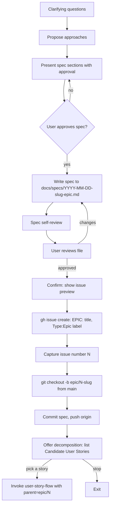

# Brainstorming: Epic / User Story Branching Flow

**Date:** 2026-04-19
**Status:** Draft
**Approach:** Extend `skills/brainstorming` with mode-dispatched companion flow files for Epic and User Story, leaving the existing Task flow untouched.

## Overview

`hey-d:brainstorming` currently drives a single linear flow: clarify → spec → `writing-plans` → implementation. That fits Task-level work, but not Epic or User Story-level artifacts, which are planning deliverables that do not produce implementation code directly and need GitHub issue + branch mechanics instead of an implementation plan.

This change introduces explicit Epic and User Story modes into the brainstorming skill. Modes are opted into by the user's opening phrasing; the default remains the existing Task flow with no behavioral change.

## Scope

### In
- Mode detection (Epic / User Story / Task) from the user's opening message.
- A dedicated Epic flow that produces a spec, creates a GitHub issue, creates an `epic/<N>-<slug>` branch from `main`, commits the spec, pushes, and offers decomposition into User Stories.
- A dedicated User Story flow that produces a spec, creates a GitHub issue, creates a `us/<N>-<slug>` branch (stacked on parent Epic branch when decomposed from an Epic, else from `main`), commits the spec, pushes, and offers decomposition into Tasks.
- Spec templates for each level, aligned with the existing `botfi/.github` issue templates where applicable.
- One explicit user confirmation before any remote side effect (`gh issue create`, `git push`).

### Out
- Changes to the Task flow. Task brainstorms continue to produce `docs/specs/YYYY-MM-DD-<slug>-design.md` and hand off to `writing-plans`. No issue or branch creation in brainstorming for Tasks.
- Publishing an Epic issue template to `botfi/.github`. The Epic spec structure lives in this skill only; the repo keeps its existing User Story / Task / Bug / Refactor templates.
- Any change to `writing-plans` or downstream execution skills.

## Mode Detection

SKILL.md adds a pre-checklist step 0:

- If the user's opening message contains an explicit Epic declaration (e.g., "brainstorm an epic…", "this is an Epic…"), load `epic-flow.md` and follow it.
- If the user's opening message contains an explicit User Story declaration (e.g., "brainstorm a user story…", "this is a US…"), load `user-story-flow.md` and follow it.
- Otherwise, proceed with the existing Task flow in SKILL.md. No question is asked; Task is the implicit default.

When a flow file is loaded, it becomes the authoritative checklist for the rest of the session. SKILL.md's task checklist only applies to the Task flow.

## File Structure

```
skills/brainstorming/
├── SKILL.md                           (modified)
├── epic-flow.md                       (new)
├── user-story-flow.md                 (new)
├── spec-document-reviewer-prompt.md   (unchanged)
└── visual-companion.md                (unchanged)
```

## Epic Flow (`epic-flow.md`)

### Process



### Spec sections

- **Goal / Problem** — what outcome this Epic unlocks and why it matters now.
- **Stakeholders** — who asked for this, who is affected, who reviews.
- **Success Criteria** — outcome-level, not feature-level.
- **Scope** — `In` and `Out` bullet lists.
- **Technical Notes** — constraints, integration points, dependencies. No designs, no code. A few sentences to a short paragraph.
- **Reference** — related issues, PRs, documents.
- **Candidate User Stories** — bullet list of stories that likely decompose from this Epic. Seed for the decomposition loop, not contractual.
- **Open Questions** — unresolved items to revisit during story decomposition.

### Spec file

- Path: `docs/specs/YYYY-MM-DD-<slug>-epic.md`.
- `<slug>` is kebab-cased, 2–4 keywords drawn from the Epic name.

### GitHub issue

- Title: `EPIC: <name>`.
- Label: `Type:Epic` (new label; created via `gh label create` on first use if absent).
- Body: all spec sections except **Candidate User Stories** and **Open Questions**. Those are working-notes for the skill's decomposition loop and do not belong on the durable issue.
- Created with `gh issue create` after explicit user confirmation showing a preview (title + labels + body).

### Branch

- Name: `epic/<N>-<slug>` where `<N>` is the created issue number.
- Base: `main`.
- Mechanics: `git checkout -b epic/<N>-<slug> main`, stage the spec file, commit, `git push -u origin epic/<N>-<slug>`. User confirmation is required before push.
- Commit message follows `.agents/config/commit.md`: `docs(brainstorming): add epic spec for <name>` (or `docs(<scope>): ...` when a more specific package scope applies). Co-author attribution applies per commit config.

### Decomposition offer

After the push succeeds, the skill presents the Candidate User Stories list and asks: "Brainstorm any of these now? (number / names / `stop`)". Picking one invokes `user-story-flow.md` with `parent=epic/<N>` context passed through.

## User Story Flow (`user-story-flow.md`)

### Process

Same shape as the Epic flow (clarify → approve → write → review → issue → branch → push → decompose), with the differences below.

### Spec sections

Mirrors the `botfi/.github` User Story template 1:1, with two appended working-notes sections:

- **User Story** — `As … I want to … So that …`.
- **Scenario** — step-by-step actor journey.
- **Definition of Done** — checklist.
- **UI** *(optional)* — mocks or notes.
- **Table Definition** *(optional)* — DB shape if relevant.
- **Implementation** — light technical notes; enough to scope, not to implement.
- **Reference** — related issues, PRs, documents. If invoked with `parent=epic/<N>`, this section includes `Part of #<N>`.
- **Candidate Tasks** — bullet list; seed for task decomposition. Stripped from the issue body.
- **Open Questions** — stripped from the issue body.

### Spec file

- Path: `docs/specs/YYYY-MM-DD-<slug>-story.md`.

### GitHub issue

- Title: `[US-<N>] <name>` matching the existing `botfi/.github` template, where `<N>` is the created issue's number. Because the number is only known after creation, the skill creates the issue with title `[US] <name>`, captures the returned number, then runs `gh issue edit <N> --title "[US-<N>] <name>"` to finalize the title.
- Label: `Type:UserStory` (existing).
- Body: all spec sections except **Candidate Tasks** and **Open Questions**. If `parent=epic/<N>`, the body starts with `Part of #<N>`.
- Created with `gh issue create` after explicit user confirmation showing a preview.

### Branch

- Name: `us/<N>-<slug>`.
- Base: the parent Epic branch (`epic/<M>-<epic-slug>`) when decomposed from an Epic; `main` when the story is standalone.
- Mechanics: `git checkout -b us/<N>-<slug> <base>`, stage, commit, push. User confirmation is required before push.
- Commit message: `docs(brainstorming): add user story spec for <name>`.

### Decomposition offer

After push, offer Candidate Tasks. Picking one invokes the existing Task flow in SKILL.md (no branch or issue is auto-created for the Task — the Task flow stays unchanged). The Task spec's Reference section is seeded with `Part of #<story_issue>` (and the Epic issue too if applicable).

## Task Flow

Unchanged. The existing SKILL.md Task path continues to produce `docs/specs/YYYY-MM-DD-<slug>-design.md` and hand off to `hey-d:writing-plans`. Branch creation remains the responsibility of `hey-d:using-git-worktrees` / `hey-d:writing-plans`.

When a Task is brainstormed from a decomposition loop (Story → Task, or Epic → Task directly), the only change is that the Task spec's Reference section is pre-seeded with `Part of #<parent_issue>`. No new issue or branch is created by brainstorming.

## Side-Effect Safety

Auto mode does not bypass confirmation for remote actions. Before each of the following, the skill pauses and asks once with a preview:

- `gh issue create` — preview title, labels, and body.
- `git push` — preview branch name and remote.

Local actions (`git checkout -b`, `git commit`, writing the spec file) proceed without extra confirmation once the spec has been approved by the user.

## Branches Config Extension

`.agents/config/branches.md` currently allows branch prefixes drawn from the commit types (`feat`, `fix`, …). `epic/` and `us/` are new prefixes specific to planning-level artifacts. This spec treats that as an approved extension: the branches config is updated to additionally permit `epic/<N>-<keyword>` and `us/<N>-<keyword>` alongside the existing commit-type prefixes.

## Commit Config

Spec commits follow `.agents/config/commit.md`:

- Format: `<type>(<scope>): <short summary>`.
- Type: `docs` for spec additions.
- Scope: `brainstorming` for spec files that describe brainstorming-skill work; otherwise the package folder the Epic/Story most directly concerns.
- Co-author attribution applies per the existing config rules.

## Backward Compatibility

- Existing Task brainstorms behave exactly as before. No changes to `docs/specs/` layout; filenames distinguish levels by suffix: `-epic.md`, `-story.md`, `-design.md`.
- The `lets-get-started` skill list description for `hey-d:brainstorming` is updated to mention the three modes. No new skill entries are added.

## Edge Cases

- **`gh` not authenticated or offline.** Skill stops at the issue-create step, surfaces the error, and asks the user whether to retry or abort. The spec file stays written locally.
- **Dirty working tree at branch-creation time.** Skill refuses to run `git checkout -b` and asks the user to commit or stash first. The spec file is created under the current branch but not staged.
- **`Type:Epic` label missing.** Skill runs `gh label create Type:Epic` (with a sensible color) on first use, then retries `gh issue create`. No user prompt for this secondary action.
- **Story decomposed from Epic but the parent branch was force-deleted.** Skill falls back to `main` as the base and warns the user in the confirmation preview.
- **User aborts at the decomposition offer.** Flow exits cleanly; spec, issue, and branch remain. Decomposition can be resumed later by re-invoking brainstorming with the relevant child declaration.

## Out of Scope for This Spec

- Revising `botfi/.github` issue templates to add an Epic template.
- Automating Task issue creation during Story decomposition. Tasks follow the existing flow.
- Worktree integration for Epic/US branches. The skill uses `git checkout -b` in the current repo; worktree usage for later implementation work remains a `using-git-worktrees` concern.

## Implementation Notes

- Mode detection is keyword-based on the user's first message in the session, not a regex over the whole transcript. Detection looks for explicit declarations ("brainstorm an epic", "this is a user story", "US:", etc.) rather than casual mentions. No confirmation is asked; if the user phrases the request explicitly, the mode is taken as given.
- `<slug>` generation is pure text: lowercase, replace non-alphanumerics with hyphens, collapse repeats, trim to at most four hyphen-separated words.
- Flow files (`epic-flow.md`, `user-story-flow.md`) are loaded via the Read tool on demand, not pre-loaded by SKILL.md, to keep token usage flat for Task-mode sessions.
