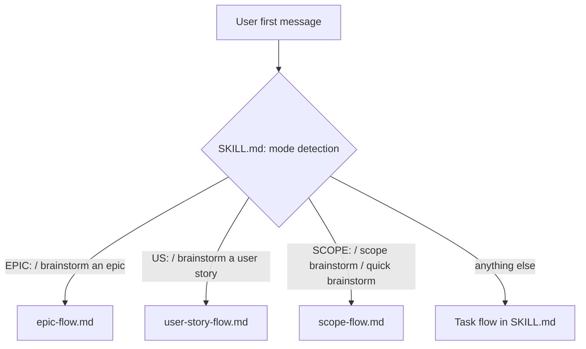
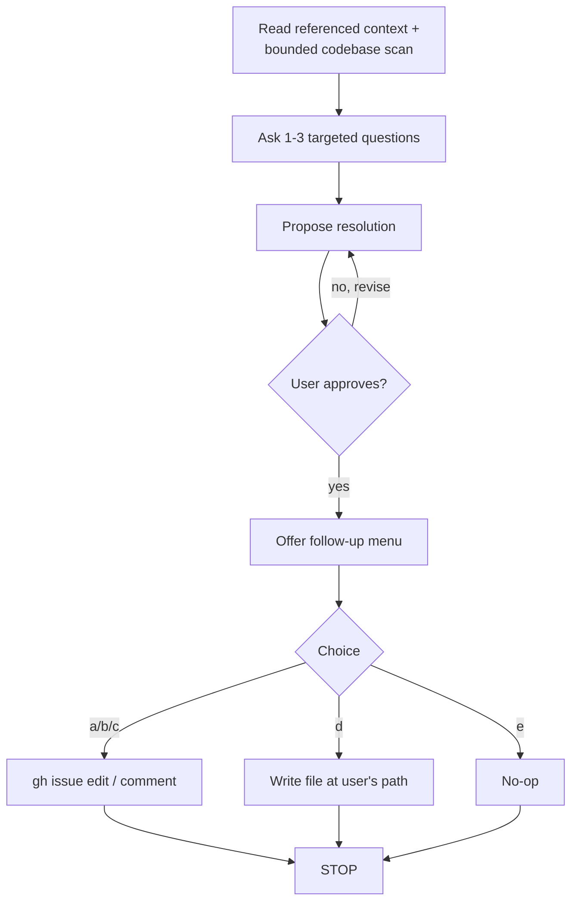

# Brainstorming: Scope Mode

## Goal

Add a fourth mode to the `hey-d:brainstorming` skill — **Scope mode** — for rapidly clearing scope or Definition-of-Done ambiguity on a ticket that is blocking another flow (most commonly `ticket-estimate`'s halt-on-weak-DoD path).

## Motivation

A recent estimation session on ZaPASS/elements #1023 had to detour through a full light brainstorm just to clear an ambiguous DoD on a ticket that already had a spec. The full brainstorm flow — design sections, spec file, commit, writing-plans handoff — is overkill when the only missing piece is a crisp DoD or a scope boundary decision. A dedicated lightweight mode keeps the estimation loop short without abandoning the discipline that "simple" tasks still need a named resolution.

## Non-goals

- **Not a replacement for Task-mode brainstorming.** If the resolution needs a design across multiple files or introduces genuinely new behavior, the user should use the full Task flow.
- **Not a generic "fast brainstorm" flag.** Extending Scope mode into a broader light mode is a future option, but not part of this design.
- **Not an auto-invoked mode.** `ticket-estimate`'s halt recommendation continues to recommend `brainstorming`; the user invokes Scope mode explicitly. Automatic mode-switching would be too magical.

## Architecture

Scope mode follows the same pattern as Epic and User Story modes: a separate flow file loaded by `SKILL.md` on trigger match.



### Priority when multiple triggers collide

`Epic > User Story > Scope > Task`. Scope sits below Epic/US so that a planning-grade brainstorm can never be accidentally downgraded.

## Trigger detection

Case-insensitive, explicit declaration only (not casual mention). In the user's first message, match any of:

- `SCOPE:` (prefix, mirrors `EPIC:` / `US:`)
- `scope brainstorm`
- `brainstorm scope`
- `quick brainstorm` (alias — matches the motivating use case's natural phrasing)

On match: announce *"Running brainstorming in Scope mode."* and load `skills/brainstorming/scope-flow.md`.

## Flow

### Checklist

Create a TodoWrite task for each item:

1. **Read referenced context + quick codebase scan** — read explicit references (ticket, spec section, file). Then a bounded codebase scan: a handful of targeted Greps for key symbols and a Glob for obviously-related directories. Surface candidate touchpoints in the resolution. Budget: no Explore subagent, no end-to-end file reads. If you catch yourself doing deep reads, stop and ask a clarifying question instead.
2. **Ask 1–3 targeted questions** — one per message, stop early if the answer is already clear. Hard budget of 3. If still ambiguous after 3, escalate (see Edge cases).
3. **Propose resolution** — a crisp, tickable answer whose shape fits what was ambiguous:
   - DoD ambiguity → bullet list of DoD items (with likely touchpoints noted)
   - Scope boundary → `In:` / `Out:` lists
   - Design decision → one-paragraph decision statement + the rejected alternative and why
4. **Get user approval** — no section-by-section gating; the resolution is one gate. Revise once or twice if needed.
5. **Offer follow-up menu** — own message, after approval:

   > Resolution approved. Persist it?
   >
   > **a)** Update issue body (replace/insert DoD section)
   > **b)** Post as a comment on the issue
   > **c)** Both body + comment
   > **d)** Write to a local file (you provide the path)
   > **e)** None — I'll handle it

6. **Execute the chosen action, then STOP.**

### Process flow



### Hard-gate adaptation

The `<HARD-GATE>` block from `SKILL.md` still applies, scaled down: *no* `gh issue edit`, *no* `gh issue comment`, *no* file writes until (a) the user has approved the resolution AND (b) explicitly picked a follow-up action. Reading (issue view, grep, glob) is free; writing requires both gates.

### Terminal state

Scope mode **does NOT** invoke `writing-plans`. `writing-plans` remains the Task-mode terminal. Scope mode ends at step 6. The user may then re-invoke whatever flow was blocked (typically `ticket-estimate`).

## Follow-up actions — reference

### (a) / (c) Update issue body

- Locate DoD section by case-insensitive heading match: `## Definition of Done`, `### Definition of Done`, `## DoD`, `### DoD`. First match wins.
- If no DoD section exists: insert `### Definition of Done` near the top of the body, above any `Implementation` / `Technical Notes` section and below any `User Story` / `Goal` block.
- Only the DoD section is rewritten. If the resolution implies changes elsewhere (e.g., updated Scope/Out-of-scope), surface that as an extra diff hunk in the preview.
- Preview the full body diff before applying. Apply with:
  ```bash
  gh issue edit <N> --repo <owner>/<repo> --body-file <path>
  ```

### (b) / (c) Post comment

Short comment containing the resolution itself plus a one-line lede stating what was clarified. Apply with:

```bash
gh issue comment <N> --repo <owner>/<repo> --body-file <path>
```

### (d) Write to local file

User provides the path. Agent writes the resolution as a plain markdown snippet (no frontmatter unless user asks).

### (e) None

No-op. Exit cleanly.

## SKILL.md changes

Three edits to `skills/brainstorming/SKILL.md`:

1. **Frontmatter `description`** — reflect four modes:

   > *"...Supports four modes: Task (default, produces an implementation plan), User Story (...), Epic (...), and Scope (triggered by 'SCOPE:' or 'quick brainstorm', produces a crisp DoD/scope resolution in chat with optional persistence — no spec file, no plan)."*

2. **Mode Detection table** — add a `Scope` row:

   | Mode | Trigger phrasing (examples, case-insensitive) | Flow file |
   |---|---|---|
   | **Scope** | `SCOPE:`, `scope brainstorm`, `brainstorm scope`, `quick brainstorm` | `skills/brainstorming/scope-flow.md` |

3. **Detection rule paragraph** — include Scope in the priority order (Epic > User Story > Scope > Task) and note that, like Epic and User Story, Scope mode follows its own flow file and the Task-mode Checklist / Process Flow sections do not apply.

No changes to Visual Companion, external-researcher, Code Style Config, or the hard-gate block — they remain shared.

## New file: `skills/brainstorming/scope-flow.md`

Contents follow the same shape as `epic-flow.md` and `user-story-flow.md`:

- Header note describing when this file is loaded and that it is authoritative for the session.
- Shared prerequisites (Code Style Config, Visual Companion offer — rarely needed in this mode).
- The Checklist above.
- The Process flow diagram above.
- Follow-up actions reference (copied from this spec's section above).
- Edge cases section (see below).

## Edge cases

- **No context reference provided.** If the user invokes `SCOPE:` without pointing at anything (ticket / spec / file), ask once for the target. Do not guess.
- **Referenced issue has no DoD section.** Insert a new `### Definition of Done` section near the top of the body, above any `Implementation` / `Technical Notes` section and below any `User Story` / `Goal` block. Preview the full diff before applying.
- **Existing DoD heading varies (`## DoD`, `### Definition of Done`, etc.).** Match case-insensitively on both headings; first match wins. If none match, treat as "no DoD section."
- **Body edit includes unrelated content.** Only the DoD section is rewritten. If the resolution implies changes elsewhere, surface them as an extra diff hunk in the preview rather than silently editing.
- **Question budget exhausted (3 asked, still ambiguous).** Stop. Tell the user: *"Three questions in and this still needs a fuller exploration. Recommend running the full Task-mode brainstorm. I'll exit Scope mode now."* Do not silently slide into Task mode.
- **Follow-up action needs credentials the agent lacks** (e.g., `gh` unauthenticated). Surface the error, leave the resolution text in chat, exit. No recovery needed — the resolution was never persisted.
- **Resolution turns out not to be scope/DoD-shaped** (e.g., it's actually a multi-file design decision). Produce it as a decision statement anyway, then in the follow-up menu recommend option `e` so the user can feed the decision into a Task-mode brainstorm.

## Testing

Manual smoke tests (no automated tests — this is a skill markdown file):

1. **Trigger detection.** Start a new session with `SCOPE: clear the DoD of issue #X` → mode announcement appears and `scope-flow.md` is loaded.
2. **Natural trigger.** `quick brainstorm for the scope of this ticket` → same.
3. **Priority.** `EPIC: rework SCOPE of billing` → Epic mode wins, not Scope.
4. **Hard-gate.** Agent does not issue `gh issue edit` or `gh issue comment` before the user has (a) approved the resolution and (b) chosen a follow-up option.
5. **Budget cap.** Seed an intentionally under-specified request; confirm that after 3 questions the agent exits with the escalation message rather than continuing.
6. **No context provided.** `SCOPE:` alone → agent asks for the target once.

## Future extensions (not in this design)

- A generic `LIGHT:` / `--light` flag that runs any mode (Task / Epic / US) with reduced ceremony. Scope mode handles the motivating case; a broader light flag can be added if demand emerges.
- Automatic Scope-mode recommendation emitted by `ticket-estimate` at its halt point (so the user sees *"try `SCOPE: #N`"* instead of the generic "recommend brainstorming"). Low-risk, trivial change once Scope mode ships.
