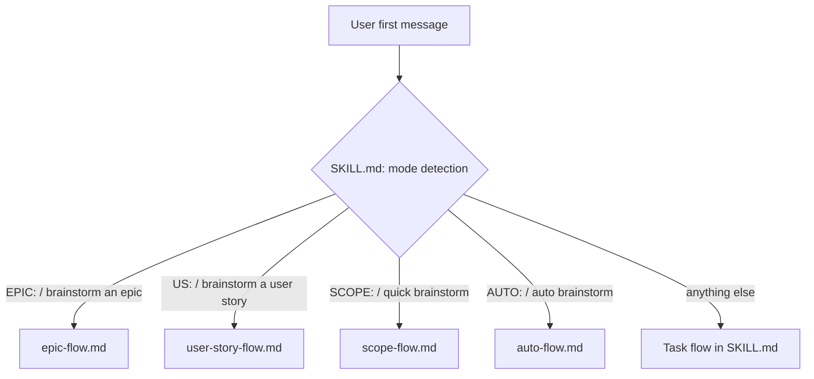
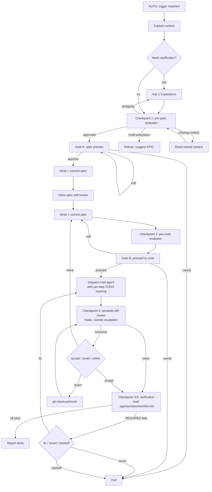

# Brainstorming: Auto Mode

## Goal

Add a fifth mode to the `hey-d:brainstorming` skill — **Auto mode** — that runs the full brainstorm → spec → plan → code pipeline end-to-end with collapsed approval gates and confidence-aware evaluator subagents at three checkpoints, so an experienced user can hand off well-scoped work without rubber-stamping every gate.

## Motivation

The existing brainstorming flows (Task / Epic / User Story / Scope) gate on user approval at each section, each artefact, and each transition. That discipline pays for itself when the request is fuzzy or load-bearing — gates catch ambiguity before it cascades into wasted spec, plan, and implementation work. But for routine work where the user already knows what they want and the agent's first proposal is "almost correct," the gates degrade into rubber-stamps. That trains the user to hit "approve" without reading carefully, which is worse than no gate at all: the gate is still nominally protecting them, but in practice it isn't.

Auto mode keeps the same artefacts (spec + plan + code, all committed) and the same anti-pattern protections (HARD-GATE; "this is too simple" doesn't excuse skipping design), but reshapes the gate pattern so that gates exist *because the evaluator flagged something*, not as a default ceremony.

## Non-goals

- **Not a replacement for Task / Epic / User Story / Scope.** Fuzzy or exploratory work, multi-subsystem decomposition, and DoD ambiguity each have a dedicated mode. Auto mode handles the well-scoped middle.
- **Not a sticky setting.** No `/auto on`, no env var, no `.agents/config/` flag. The `AUTO:` prefix declares intent for *that single request*. Sticky modes drift — you turn it on for one trivial thing, forget, then a fuzzy request slips past the gates.
- **Not a way to skip the HARD-GATE.** The design IS shown before any implementation action — at Gate A (spec preview) and again at Gate B (proceed-to-code). The change is in the *shape* of the gate, not its presence.
- **Not an auto-upgrade path.** A request that turns out to be Epic-shaped is *refused* with a recommendation to re-run as `EPIC:`. Auto-restarting in another mode would surprise the user.
- **Not multi-session pause/resume.** Auto-mode pause/resume relies on git + TodoWrite state, which is durable, but the orchestrator's understanding of "where it was" is rebuilt from those sources on each turn within the same session. Cross-session resume is not in scope for this iteration.

## Architecture

Auto mode is a sibling flow to Epic / User Story / Scope — a separate flow file (`skills/brainstorming/auto-flow.md`) loaded by `SKILL.md` on trigger match.

### Priority when multiple triggers collide

`Epic > User Story > Scope > Auto > Task`. Auto sits below the collaborative modes so a planning-grade or fuzzy brainstorm can never be silently downgraded into an autonomous run.

## Trigger detection

Case-insensitive, explicit declaration only. In the user's first message, match any of:

- `AUTO:` (prefix, mirrors `EPIC:` / `US:` / `SCOPE:`)
- `auto brainstorm`
- `run auto`
- `end-to-end`

On match: announce *"Running brainstorming in Auto mode."* and load `skills/brainstorming/auto-flow.md`.

The trigger is **per-invocation**. Auto mode declarations do NOT persist across requests within a session; the next message without `AUTO:` runs the normal gated flow.

## Flow

### Checklist (13 steps)

1. Explore project context (bounded — files, docs, recent commits)
2. Ask clarifying questions ONLY if required to resolve load-bearing ambiguity (max 3, one per message)
3. **Checkpoint 1** — pre-spec evaluator (blocking)
4. **Gate A** — spec preview (shape depends on Checkpoint 1)
5. Write the spec to `docs/specs/YYYY-MM-DD-<slug>-design.md` and commit
6. Inline spec self-review — fix inline
7. Write the implementation plan to `docs/plans/YYYY-MM-DD-<slug>.md` and commit
8. **Checkpoint 2** — pre-code evaluator (advisory)
9. **Gate B** — proceed-to-code preview (shape depends on both checkpoints)
10. Dispatch the implementation agent with mandatory per-plan-step TodoWrite tracking
11. **Checkpoint 3** — post-code semantic review (always-on, Haiku default; Sonnet escalation only on low/medium-confidence concerns)
12. **Checkpoint 3.5** — verification (run REQUIRED commands from `.agents/rules/checklist.md`)
13. Report done

### Process flow

## Two-shape gates

The collapsed-gate design hinges on a single principle: **a gate's shape should reflect the evaluator's confidence, not be fixed.** When the evaluator has cleared the path with no concerns, the gate is mostly ceremony — and ceremony trains rubber-stamping. When the evaluator flagged something, the gate must be substantive.

### Gate A — spec preview

- **Blocking shape** — used when Checkpoint 1 needed any clarification round (≥1 question asked, or returned `ambiguity` / `missing-context` before approving). Presents the spec and waits for explicit `approve` / `edit` / `cancel`.
- **Advisory shape** — used only when Checkpoint 1 cleared on the first dispatch with zero clarifying questions. Presents the spec and continues immediately to step 5 in the same turn. No approval prompt.

### Gate B — proceed to code

- **Blocking shape** — default. Used whenever EITHER condition fails: Checkpoint 1 needed clarification, OR Checkpoint 2 returned `concerns`.
- **Advisory shape** — used ONLY when both checkpoints cleared on the first try with no concerns. Presents the spec+plan summary and continues immediately to dispatch in the same turn. No approval prompt.

The Gate B advisory condition is stricter than Gate A's because code dispatch is more consequential than writing a spec file. Any concerns at any checkpoint disqualify the advisory shape.

### "Advisory" does not mean "wait N seconds"

This is the most subtle design point and the easiest to get wrong. **Claude has no timer mechanism.** An earlier draft of this design described the advisory shape as "auto-advance after ~10 seconds — say `wait` to interject." That framing is fiction: there is no internal countdown.

What "advisory" actually means: the orchestrator emits the preview text and *immediately* continues to the next tool call within the same turn. The user's interrupt mechanisms are:

- **Ctrl-C** to stop the running session entirely (real emergency stop).
- **Type a message** that's queued and processed on the next turn (treated as a pause; see Pause and Resume).

Auto-mode language must never describe a wait window that doesn't exist. The behaviour is *auto-advance*, not *auto-advance-after-delay*. Checkpoints 3 and 3.5 are the safety net for anything missed at Gate B.

## Confidence checkpoints

Four evaluator stages, each with a specific failure mode it's designed to catch.

### Checkpoint 1 — pre-spec evaluator (blocking)

Dispatched after clarifying questions, before Gate A. Subagent reads the conversation so far and verdicts whether there is enough signal to produce a single correct spec.

**Verdicts:** `approved` / `ambiguity` (ask one question, re-run) / `multi-subsystem` (refuse Auto, suggest EPIC) / `missing-context` (read named target, re-run).

**Why blocking:** ambiguity caught at this stage costs one question; ambiguity caught after spec or plan costs the rework of both. The cost asymmetry is large enough that this checkpoint earns its block.

### Checkpoint 2 — pre-code evaluator (advisory)

Dispatched after the plan is written, before Gate B. Subagent reads spec + plan and verdicts whether the plan implements the spec without scope jumps or surprises.

**Verdicts:** `approved` / `concerns` (with bullet list).

**Why advisory:** by this stage the user has already invested in the spec; a hard block here would force a manual re-design loop on every minor concern. Surfacing the concerns at Gate B and letting the user decide preserves their authority.

### Checkpoint 3 — post-code semantic review (always-on, Haiku default)

Dispatched after the implementation agent reports done, before declaring the auto-flow complete. Two layers: (a) deterministic file-list parity check (cheap, inline), and (b) semantic diff review by a Haiku subagent answering *"does this diff plausibly match what the plan said would happen?"*

**Why always-on, not threshold-based:** an earlier draft used a line-count threshold (e.g., escalate to semantic review only if diff > N lines). That misfires on legitimate new files (a brand-new component is "expected work," not "scope drift") and is brittle in either direction. Always-running semantic review with a cheap model scales naturally by *scope match*, not by *size*.

**Model choice:** Haiku is the default — fast, cheap, sufficient for a focused diff-vs-plan match check. If Haiku returns `concerns` with low or medium confidence, re-dispatch the same prompt with Sonnet for a second opinion; Sonnet's verdict is final. Approved verdicts are NEVER escalated (escalating approvals wastes compute). Opus is not used at this checkpoint.

### Checkpoint 3.5 — verification (run the project's go-signal commands)

Dispatched after Checkpoint 3 passes, before declaring done. Runs the project's own verification commands so Auto mode never reports done on a broken state.

**Source of truth:** `.agents/rules/checklist.md` at the repository root. The orchestrator looks for a section heading like *"Before finishing"* / *"Verification"* / *"Pre-completion checks"*, parses the bulleted commands, classifies items by `REQUIRED` / `RECOMMENDED` markers, and runs them in order.

**Why `.agents/rules/checklist.md` (not a new `.agents/config/verify.md`):** verification commands are part of the team's broader implementation discipline, not a single-purpose Auto-mode setting. Reusing the system-wide convention (which projects already populate for general agent use) keeps the mental model coherent and avoids inventing a parallel single-purpose config.

**Critical detail:** preserve command prefixes exactly as written. `CI=1` is load-bearing for some test runners (without it, Vitest hangs in watch mode). The orchestrator does not "clean up" or "normalise" commands.

**Fallback when checklist is absent:** attempt a small set of common script names (`pnpm test`, `npm test`, `cargo test`, `go test ./...`). If nothing matches, **skip with a visible notice** — never silently pass. Visibility is mandatory because a silent skip would let Auto mode declare done on entirely unverified code.

## TODO visibility (mandatory in Auto mode)

In Task / Epic / US flows, the per-section approval dialogue gives the user natural visibility into what the agent is doing. Auto mode deliberately removes that dialogue at Gates A and B, so the TodoWrite list has to carry the visibility load.

This is not optional. Step 10 (dispatch implementation agent) explicitly requires the orchestrator to:

1. Expand the plan into TodoWrite entries — one per atomic step, not one per plan section.
2. Pre-populate descriptions with concrete targets (specific files, specific changes — not "implement feature X").
3. Hand the task list to the implementation agent with explicit tracking rules: mark `in_progress` *before* starting, `completed` *immediately* upon finishing, never batched. Add new entries for newly-discovered sub-steps (don't silently expand the current task's scope). Leave blocked tasks `in_progress` and surface the blocker.

The principle: **stale TODO state is recoverable, lies are not.** Don't retroactively clean up a messy TODO list — that erases the signal that something went off-script.

## Pause and resume

Because there is no real timer, the user's only way to interject during an advisory-shape gate or mid-coding is to interrupt the session. Auto mode treats those interruptions as **pauses, not aborts**.

**State sources (all durable, all external to chat):**

- Git log — spec commit (`docs(brainstorming): add spec for <name>`) and plan commit (`docs(brainstorming): add plan for <name>`) tell the resume path which steps already ran.
- TodoWrite list — `in_progress` task is the paused step.
- Working tree — `git status` shows uncommitted in-flight work.

No marker file or sidecar state is needed.

**Pause:** orchestrator finishes the in-flight tool call to keep state coherent, emits a one-line pause notice, and exits the turn. Does NOT auto-advance even if the pause happened during an advisory-shape gate.

**Resume:** when the user's next message contains `continue` / `resume` / `keep going` / `resume auto`, the orchestrator inspects state, presents a status summary, and asks `resume / restart / abort`.

**Limitation:** a queued `wait` while a subagent is mid-run only takes effect after the subagent returns. Ctrl-C is the real emergency stop. Documented in the flow file so the user knows.

## Scenarios

### Scenario 1 — Happy path (well-scoped; both checkpoints pass)

> `AUTO: add a /reset slash command that wipes .agents/cache/ after confirmation`

Auto-flow: 1 clarifying question (*"confirmation in chat or os-level?"*), Checkpoint 1 returns `approved` after the answer (so it counted as needing clarification — Gate A blocks), spec preview presented + approved + committed, plan written + committed, Checkpoint 2 returns `approved` (Gate B blocks because Checkpoint 1 needed clarification), user proceeds, implementation agent dispatched with per-step TODO list, Checkpoint 3 (Haiku) returns `approved`, Checkpoint 3.5 runs `CI=1 pnpm test:unit` clean, done.

**User sees:** ~5 messages total. TodoWrite list updates live during the coding phase.

### Scenario 2 — Checkpoint 1 fires (blocking, ambiguity)

> `AUTO: improve the brainstorming flow`

Checkpoint 1 verdict: `ambiguity` — *"'improve' could mean (a) add a new mode, (b) refactor existing flow files for shared logic, (c) tighten HARD-GATE rules, (d) reduce token cost."*

Auto-flow surfaces the question as a 4-choice multiple choice. User picks (c). Re-runs Checkpoint 1 → `approved`. Continues from Gate A in *blocking* shape (clarification was needed).

**Why this scenario matters:** this is the failure mode the gates earn their keep on. Without Checkpoint 1, Auto-flow would have written a spec for whichever interpretation the model picked first.

### Scenario 3 — Checkpoint 2 fires (advisory, plan drift)

> `AUTO: add release-notes generation to the release skill`

Spec is clean: *"append a generated section to RELEASE-NOTES.md per release."* Plan-writer gets ambitious and proposes a new templating subsystem with 4 helper files. Checkpoint 2 returns `concerns: plan introduces a templating layer not mentioned in spec — scope expansion.`

Gate B presents in blocking shape (concerns disqualify advisory). User sees both the normal preview AND the evaluator's notes. Decides: confirm the expansion (spec was under-specified), narrow the plan, or cancel.

### Scenario 4 — Hidden multi-subsystem (refused, suggest EPIC)

> `AUTO: add a webhook system for plugin updates`

Looks like one feature; actually five (endpoint + auth + retry + signature verification + management UI). Checkpoint 1 verdict: `multi-subsystem`.

Auto mode refuses: *"This describes multiple independent subsystems. Auto mode would skip the decomposition step, which is load-bearing here. Recommend re-running as `EPIC:` — that flow has the collaborative decomposition pass that this change needs."* Exits the skill.

**No auto-upgrade.** The user must explicitly re-invoke as `EPIC:`. Auto-restarting Epic mode without consent would be too magical and Epic needs the human-led decomposition conversation.

### Scenario 5 — Code agent scope creep (caught by Checkpoint 3 semantic review)

> `AUTO: fix bug where epic-flow.md doesn't read .agents/config/branches.md`

Both pre-code checkpoints pass cleanly (high-confidence; both gates advisory). Implementation agent fixes the bug AND decides to "also refactor the related path-resolution helper while I'm here."

**Original draft of this design had this as a "current gap"** — Checkpoint 3 was file-list parity only. The refactored helper is in the same file as the bug fix, so file-list check passes; the unintended refactor goes undetected. That gap was closed in the hardening pass: Checkpoint 3 now always runs semantic review, which catches this — the diff includes hunks that don't trace to plan steps, so the Haiku reviewer returns `concerns: helper refactor not in plan`.

User sees the concern at the post-code prompt and chooses `accept` (refactor was a good idea) / `revert` (revert the unrelated changes) / `refine` (amend plan to reflect reality and re-run).

### Scenario 6 — User edits spec at advisory Gate A

> `AUTO: add a config flag to opt out of telemetry`

Checkpoint 1 clears first try. Gate A is advisory — preview is presented, orchestrator continues to write the spec in the same turn.

User reads the preview *while the spec is being written* and types: `wait, the flag should default to true (opt-in by default), not false`. The message is queued and processed on the next turn.

The orchestrator treats the new turn as a pause, then resume with edit. It amends the in-progress spec file, reruns the inline self-review, and continues. No work is lost — the spec was committed with the original framing, the amendment is a follow-up commit.

**Key point:** there was no countdown. The user's interjection arrived because they read the preview and typed quickly, not because Auto mode "waited."

### Scenario 7 — User cancels at Gate B advisory after seeing the plan

> `AUTO: refactor the brainstorming SKILL.md to extract Task flow into its own file`

Both checkpoints pass; Gate B is advisory. Orchestrator presents preview and starts dispatching the implementation agent.

User reads the plan summary, realises the refactor would break a downstream flow they care about, types: `cancel`. The dispatch tool call has already started; the orchestrator finishes the in-flight call (so state stays coherent), emits a pause notice, and exits.

On the user's next turn (`abort`), exits cleanly. Spec and plan remain on disk; no implementation work was committed. The user can resume later by removing the spec/plan and re-invoking, or use them as a starting point for a manual Task-mode session.

### Scenario 8 — User steers mid-coding with new direction

> `AUTO: add a JSON export option to the user export command`

Implementation agent is mid-flow at TodoWrite task 4 of 7. User notices the agent picked the wrong CSV-to-JSON conversion library and types: `wait, use the one from src/util/json.ts, not the new dependency you just added`.

Pause: orchestrator finishes the in-flight tool call, emits pause notice. Resume: user types `continue`. Orchestrator presents status (TodoWrite task 4 in-flight, working tree dirty with the unwanted dependency), then offers `resume / restart / abort`.

User picks `restart` for task 4 (revert the dependency add, redo with the existing util). Orchestrator reverts the dirty changes for task 4, resets the TodoWrite entry to `pending`, and re-dispatches task 4 with the correction in the prompt context.

### Scenario 9 — User says "continue" without a prior pause

> *(no prior Auto run)* `continue`

No-op. Orchestrator replies: *"No paused Auto run in this session — start a new one with `AUTO: <request>`."* Does NOT silently start a new flow.

### Scenario 10 — Checkpoint 3.5 REQUIRED command fails (fix path)

Implementation agent finishes. Checkpoint 3 (semantic) passes. Checkpoint 3.5 reads `.agents/rules/checklist.md`, runs `CI=1 pnpm test:unit` — one test fails (an existing test broke because of the change).

Orchestrator presents the last 30 lines of stderr and offers `fix / revert / handoff`. User picks `fix`. Orchestrator adds a TodoWrite entry scoped to the failure, re-dispatches the implementation agent with the test failure as additional context (NOT a general re-pass; narrow scope). When the agent reports done, re-runs Checkpoints 3 and 3.5. If the test passes this round, continue to step 13 (report done). If it fails again, switch to `handoff` — Auto mode is not the right tool for stubborn failures.

### Scenario 11 — Checkpoint 3.5 skipped because no checklist + no recognised script

Project has no `.agents/rules/checklist.md` and no `pnpm test` / `npm test` / `cargo test` / `go test ./...` recognised script. Orchestrator emits the visible skip notice:

> No `.agents/rules/checklist.md` found and no recognised default verification script. Skipping Checkpoint 3.5 — the implementation is not verified.

Continues to step 13. The done summary makes the skipped verification explicit. **Visible skip is mandatory** — silent skip would let Auto mode declare done on entirely unverified code, which would erode trust in every future "done" report.

### Scenario 12 — Cross-mode collision: AUTO: + EPIC: in same trigger

> `AUTO: EPIC: add a webhooks subsystem`

Mode detection priority is `Epic > User Story > Scope > Auto > Task`. Epic wins. Auto-flow is never loaded. Orchestrator announces *"Running brainstorming in Epic mode."* and proceeds with `epic-flow.md`. The user's `AUTO:` declaration is ignored — the priority rule exists precisely because planning-grade modes must never be downgraded.

## Edge cases

- **Question budget exhausted at Checkpoint 1.** If 3 clarifying questions still leave Checkpoint 1 returning `ambiguity`, exit Auto mode cleanly with: *"Three rounds of clarification and this still has load-bearing ambiguity. Auto mode isn't a fit for this one — recommend running the normal (Task) brainstorm so we can work through the design together."* No silent degrade.
- **Gate A was advisory but Checkpoint 2 returned `concerns`.** Gate B MUST use the blocking shape — the concerns invalidate the "whole flow was high-confidence" signal. Hard rule.
- **Implementation agent fails or aborts.** Treat as pause, not abort. Pause notice + exit; user can `resume` (re-dispatch with failure context), `restart` (revert and re-run step 10), or `abort`. TodoWrite tasks left in their actual state — never retroactively marked `completed`.
- **Implementation agent skipped TODO updates.** Discipline failure of the coding agent, not a flow design issue. Re-emphasise rules in the next dispatch prompt; do NOT back-fill the TODO list (back-filling erases the signal that the agent wasn't following the protocol).
- **Spec commit exists but plan commit missing at resume time.** Pause happened between step 6 and step 7. Resume by running step 7, then Checkpoint 2, then Gate B.
- **Plan commit exists but implementation work is partial at resume time.** Pause happened at or after step 10. Inspect TodoWrite + `git status`, present `resume / restart / abort`.
- **`.agents/config/` files missing.** Fall back to Conventional Commits defaults for commit messages. Separate from `.agents/rules/checklist.md` handling.
- **`.agents/rules/checklist.md` exists but the verification section is empty or missing.** Fall back to common-script heuristic; visible skip if none match.

## Open Questions

- **Cross-session resume.** Today, "pause" + "resume" works within a single session. A user closing their terminal and starting a new session tomorrow loses the in-memory orchestrator state but has all the durable state (commits, TodoWrite, working tree). Should `AUTO: resume` (or `resume auto` as a first message in a fresh session) be supported? Defer for now — observe how often users actually need this.
- **Streaming Checkpoint 3 / 3.5 output.** Today the post-code checkpoints run after the implementation agent fully returns. For long implementations this means the user waits silently until everything is done. Worth exploring whether checkpoints can run incrementally per-commit, but adds significant complexity. Deferred.
- **Default model (Haiku) for Checkpoint 3 — when does Sonnet escalation actually fire?** The escalation rule is "Haiku returns concerns with low/medium confidence." Need to observe in practice whether Haiku's confidence calibration is reliable enough that this rule earns its keep, or whether Sonnet should be the default. Add telemetry once Auto mode has been used 10+ times.
