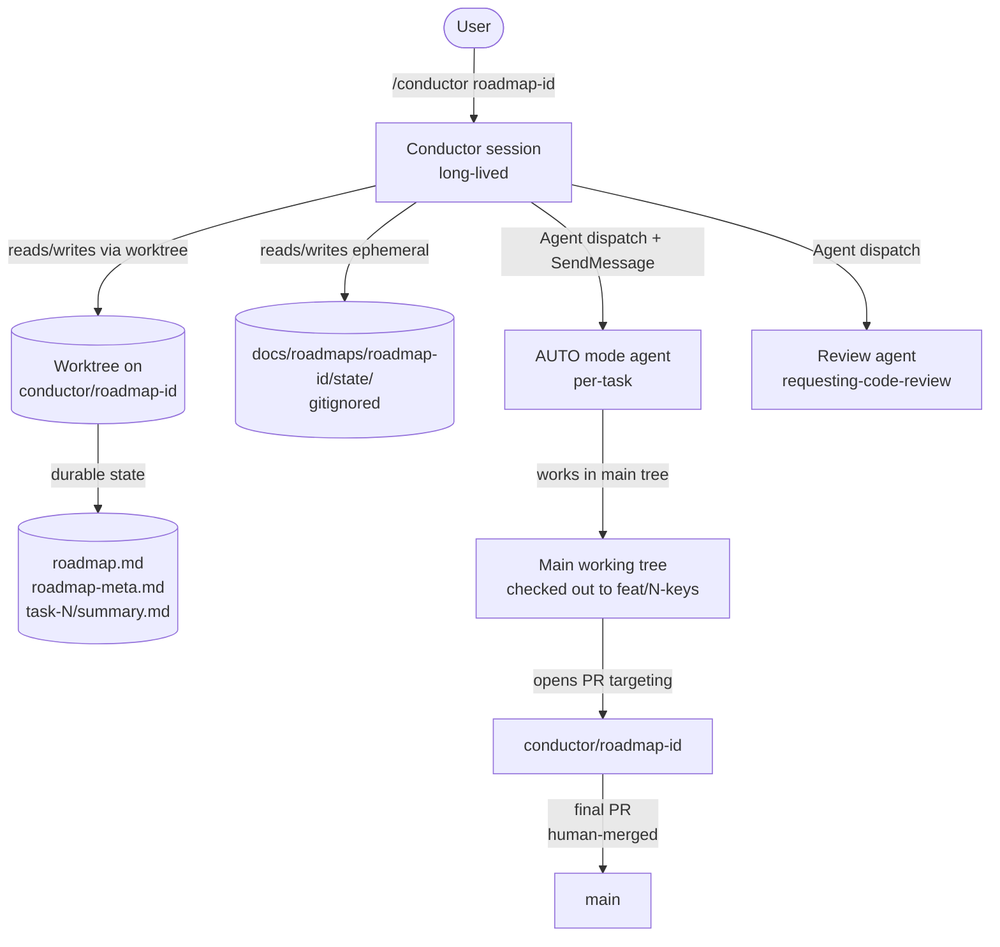
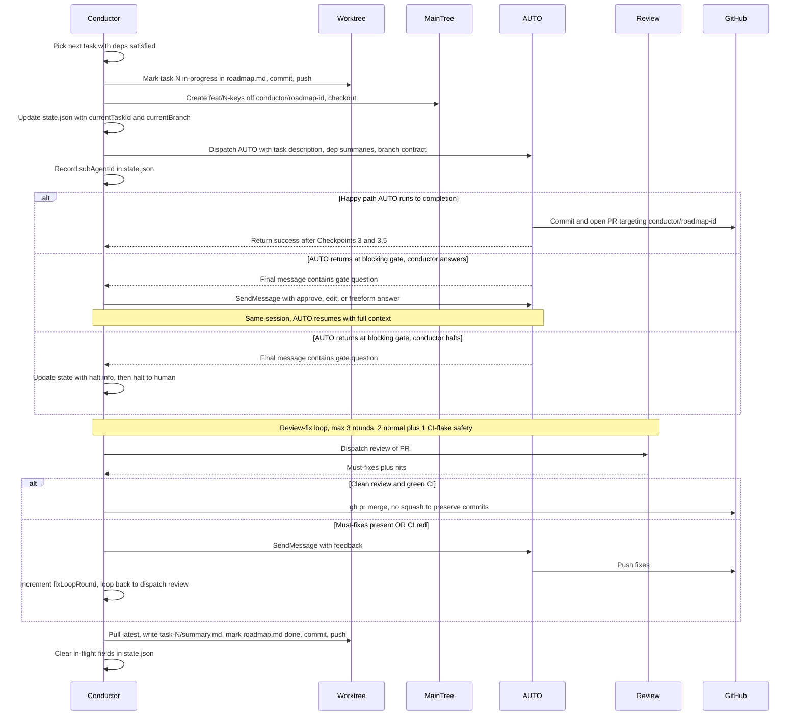

# Conductor — Multi-Task Roadmap Orchestration

**Status:** Design draft
**Date:** 2026-04-30

## Purpose

A new hey-d skill (`hey-d:conductor`) that orchestrates **multi-task roadmap execution** by dispatching AUTO-mode brainstorming agents in sequence. Conductor itself does not write code or make product decisions — its job is to (1) walk a roadmap of tasks, (2) act as user-proxy at AUTO's existing gates, and (3) handle the per-task git-flow ceremonies (branch create, PR review, integration merge) that AUTO does not own.

Today AUTO requires a human gate-keeper between every task. Conductor lets a developer set up a roadmap, walk away, and come back to a finished integration branch ready for a single human-reviewed PR to `main`.

## Non-goals

- **Roadmap creation flow.** Conductor reads roadmaps; it does not generate them. `roadmap.md` is hand-written or produced by a separate brainstorm session (the epic-flow output is one natural source for v2).
- **Cross-roadmap orchestration.** One conductor session = one roadmap.
- **Auto-merge of the final PR to `main`.** Always human-gated.
- **Parallel task execution.** v1 is strictly sequential.
- **Skipping or re-ordering tasks at runtime.** Roadmap edits require explicit user action between tasks.

## Architecture

In this diagram, `roadmap-id`, `N`, and `keys` are placeholders for the runtime values.



### Key invariants

- **Conductor session is long-lived.** One session per roadmap. Resumable from disk state — no in-memory recovery.
- **AUTO is unchanged.** Conductor plugs into AUTO's existing gates (Step 2 clarifying, Gate A, Gate B) by acting as the user via SendMessage.
- **Per-task work merges to `conductor/<roadmap-id>` (integration branch), never directly to `main`.** Final PR `conductor/<roadmap-id>` → `main` is always human-reviewed and human-merged.
- **The main working tree stays available for AUTO and dev tooling.** Conductor's state writes happen in a separate git worktree to avoid disrupting watchers, dev servers, and build caches that operate on the main tree.

## State persistence model

State is split into two layers with deliberately different durability and visibility semantics.

### Durable state (committed to `conductor/<roadmap-id>`, pushed to GitHub)

Lives under `docs/roadmaps/<roadmap-id>/`:

| File | Purpose | Update cadence |
|---|---|---|
| `roadmap.md` | Task index with status (pending / in-progress / done / halted / failed) and dependency hints | At task boundaries — one commit per status transition |
| `roadmap-meta.md` | Roadmap-level configuration: base branch, creation timestamp, owner, any conductor-config knobs | Once at init; amended only on user action |
| `task-<N>/summary.md` | Per-task completion record (built / decided / touched / gotchas — strict shape) | Written once on task success |

Concrete schemas for `roadmap.md` and `summary.md` are deferred to the implementation plan (writing-plans), but their categories are fixed in this spec.

### Ephemeral state (gitignored, per-machine)

Lives at `docs/roadmaps/<roadmap-id>/state/` **inside the conductor worktree** (see Worktree layout below). Because gitignored files do not synchronize between working trees, the state directory only exists in the conductor's own worktree — the main working tree never sees it. Conductor always reads and writes state files relative to its worktree path.

| File | Purpose | Update cadence |
|---|---|---|
| `state.json` | In-flight runtime state — see field reference below | Frequently — every gate, every fix-round, every SendMessage round-trip, every phase transition |

`.gitignore` line added: `docs/roadmaps/*/state/`

#### `state.json` field reference

| Field | Type | Purpose |
|---|---|---|
| `currentTaskId` | number | Which task in `roadmap.md` is active. |
| `currentBranch` | string | Per-task feat branch checked out on the main tree (e.g., `feat/2-token-storage`). |
| `subAgentId` | string \| null | The dispatched AUTO agent's ID, used for SendMessage continuation. |
| `dispatchedAt` | ISO-8601 string | When the current AUTO dispatch went out. |
| `autoReturnedAt` | ISO-8601 string \| null | When AUTO last returned (success or gate question); null while AUTO is running. |
| `phase` | enum (see below) | The state machine's current position. **Resume's first action is `switch (phase)`.** |
| `lastHaltAt` | ISO-8601 string \| null | When conductor last halted to a human (only set in halt phases). |
| `lastHaltQuestion` | string \| null | The question or failure that triggered the halt. |
| `fixLoopRound` | number | Review-fix iteration count, 0–3. |
| `currentReviewId` | string \| null | Review-iteration tracker — the dispatched review agent's ID. Used to know whether feedback for *this* round has already been sent. |
| `prNumber` | number \| null | The per-task PR number (from `gh pr create`). |
| `prUrl` | string \| null | Convenience for human-facing reporting. |

**`phase` enum (exhaustive):**

| Phase | Meaning | Resume action |
|---|---|---|
| `dispatching` | Conductor is in the middle of branch-create + AUTO dispatch. | Re-do branch setup if missing; re-dispatch. |
| `auto-running` | AUTO has been dispatched and has not yet returned. | Try `SendMessage subAgentId`; if it fails, re-dispatch with continuation note. |
| `auto-blocked-on-gate` | AUTO returned with a gate question; conductor halted to human. | Wait for human answer; on resume, SendMessage the answer (or re-dispatch if agent died). |
| `awaiting-review` | AUTO returned success and PR is open; review agent not yet dispatched. | Dispatch the review agent on `prNumber`. |
| `review-running` | Review agent has been dispatched. | Try SendMessage to `currentReviewId`; if dead, re-dispatch review on the same PR. |
| `review-feedback-sent` | Review returned must-fixes; SendMessage'd to AUTO; awaiting AUTO's push. | Try SendMessage `subAgentId` to nudge; if dead, re-dispatch AUTO with feedback context. |
| `awaiting-merge` | Review clean + CI green; conductor about to call `gh pr merge`. | Verify PR still mergeable, then merge. |
| `summary-writing` | Merged successfully; writing `task-N/summary.md` and updating `roadmap.md`. | Verify summary write idempotently; complete the commit + push. |
| `task-halted` | Round counter exceeded, AUTO failed, or conductor couldn't answer a gate. | Surface halt info to human; await `resume` / `restart` / `abort`. |
| `done` | This task is complete; conductor moves to next. | Pick next task with deps satisfied; start at `dispatching`. |

### Why split this way

- Durable state is project history worth keeping in git: who ran which roadmap, in what order, with what outcomes.
- Ephemeral state is per-machine runtime — it would be wrong to commit `subAgentId` (meaningless on another machine) or `lastHaltQuestion` (live debugging context, not history).
- Splitting also keeps per-task PRs clean: no roadmap bookkeeping leaks into the per-task code diff because conductor writes durable state on the integration branch via a separate worktree, never on the feat branch.

### Worktree layout

- **Main working tree** (`<repo>/`) — used for feat branches; AUTO and dispatched implementation agents work here. Dev tooling (watchers, dev servers, build caches) stays uninterrupted.
- **Conductor worktree** — created at a path under `.worktrees/conductor-<roadmap-id>/` (the existing `.worktrees/` is already gitignored), checked out to `conductor/<roadmap-id>`. Conductor uses this path exclusively for state commits (roadmap.md, summaries). Never touched by AUTO or implementation agents.

The user's tooling (dev server, watchers) stays on the main tree, unaffected by conductor's state writes.

### Worktree discipline rules

These five rules are load-bearing and must be enforced by `conducting-flow.md`:

1. **Conductor's CWD stays on the main tree.** Do NOT `cd` into the worktree — the working directory is inherited by Agent dispatches; if conductor's CWD becomes the worktree, AUTO would inherit it and commit to `conductor/<roadmap-id>` directly. All conductor operations targeting the worktree use **absolute paths** or `git -C <worktree-path>` instead.
2. **AUTO inherits the main-tree CWD.** AUTO sees `feat/<N>-<keys>` checked out on the main tree and works there normally. No special instructions needed beyond the dispatch contract.
3. **Same branch never in two worktrees.** `conductor/<roadmap-id>` is held by the conductor worktree, so the main tree never directly checks it out. The main tree only checks out per-task feat branches that were *branched off* `conductor/<roadmap-id>`.
4. **After `gh pr merge`, refresh the worktree's ref before writing the summary.** The merge commit lands on remote `conductor/<roadmap-id>`; the worktree's local copy is stale until conductor runs `git -C <worktree> fetch && git -C <worktree> reset --hard origin/conductor/<roadmap-id>`. Skipping this means writing `summary.md` against a stale tip and rejecting on push.
5. **Clean up the worktree at end-of-roadmap.** Once the final PR is opened, conductor runs `git worktree remove <worktree-path>`. State directory (gitignored) goes with it. The integration branch survives on the remote until the human merges or deletes it.

## Per-task lifecycle

In this diagram: **C** = Conductor, **WT** = Conductor worktree on `conductor/<roadmap-id>`, **MT** = Main working tree, **A** = AUTO agent, **R** = Review agent, **G** = GitHub. Placeholder names (`N`, `keys`, `roadmap-id`) appear bare for parser compatibility.



### Conductor's "answer authority" rule

When AUTO returns at a blocking gate, conductor decides whether to answer or halt. The rule:

> Answer **only** if the answer is grounded in `roadmap.md` + `roadmap-meta.md` + prior task summaries + visible repo state. Anything else — novel product decisions, ambiguous requirements not in the roadmap, missing-context exploration calls — **halt to human**.

Codified in the skill as `references/answer-authority.md` for consistent application.

### AUTO dispatch contract

Every AUTO dispatch the conductor makes must include the following contract items in the prompt — these are the contract beyond AUTO's normal inputs:

- **Branch context.** "You are on `feat/<N>-<keys>`, which is checked out off `conductor/<roadmap-id>`. All commits land here. Do not switch branches."
- **PR target.** "When you reach the implementation step's PR-creation phase (via the `pull-request` skill), the PR base must be `conductor/<roadmap-id>`, NOT `main`."
- **PR-required.** "You MUST open the PR via `pull-request` before returning success. Returning success without an open PR is a contract violation; conductor will halt."
- **Continuation note (re-dispatch only).** When the dispatch is a re-dispatch after a failed `SendMessage` (sub-agent died), the prompt also includes: "This is a continuation of a prior run that was interrupted. The feat branch `feat/<N>-<keys>` may already contain commits, a spec under `docs/specs/`, or a plan under `docs/plans/`. Inspect the branch state before starting; do not duplicate already-committed work."

Conductor enforces these by checking the AUTO return: if the return claims success but no PR exists targeting `conductor/<roadmap-id>` from the recorded `currentBranch`, conductor halts with a contract-violation error rather than proceeding to the review loop.

### SendMessage round-trip mechanic

Important clarification on how conductor "answers" AUTO:

- AUTO sub-agent runs its turn → emits the gate question as text → naturally ends its turn → Agent tool returns to conductor.
- Conductor reads the return, decides on an answer, calls `SendMessage` with the agent ID and the answer text.
- The sub-agent re-runs in its **existing session**, sees the new user message, interprets it as the gate response (because that's exactly what AUTO's blocking-gate prompt asked for), and continues.

This is functionally equivalent to "pause and resume" but mechanically it is "return + SendMessage in the same session." There is no actual paused-running state on the sub-agent side. The same-session continuity is what preserves AUTO's full context (spec, plan, prior gate exchanges).

### Sub-agent ID dual-path on resume

On conductor resume after a crash, the recorded `subAgentId` may or may not still be alive (sub-agent process lifetime under parent death is undocumented — see Risks). Conductor handles both:

1. **Try SendMessage to recorded `subAgentId`.** If it succeeds, conductor and AUTO pick up where they left off.
2. **If SendMessage fails** (agent gone, beyond cleanup window), conductor **re-dispatches a fresh AUTO agent** with the dispatch contract's continuation note enabled: roadmap.md task description + dep summaries + the `lastHaltAt` / `lastHaltQuestion` recorded in `state.json` + the explicit instruction to inspect the feat branch for partial commits, spec, or plan before starting. The new dispatch may complete the work from where the prior run stopped (because AUTO is designed to detect existing spec/plan commits) or may amend if the partial state is bad. Conductor records the new `subAgentId` and proceeds.

## Review-fix loop

| Outcome | Conductor action |
|---|---|
| Clean review + green CI | Proceed to merge |
| Must-fixes present | SendMessage feedback to AUTO; AUTO pushes fixes; re-review (round counter increments) |
| CI red, review clean | Treat as part of fix loop — feed CI output to AUTO; allow up to 3rd round for genuine flake retry |
| Round counter > 3 | **Halt.** Surface latest review + diff + CI logs to human |

The review agent invokes `requesting-code-review` (existing skill); AUTO invokes `receiving-code-review` (existing skill) on its end to triage feedback. Conductor only orchestrates; it does not reimplement either side.

## Merge and end-of-roadmap

### Per-task merge

When a per-task PR has clean review + green CI, conductor calls `gh pr merge` **without squash** — every commit on the feat branch is preserved on the integration branch. Rationale: the user wants full commit history retained for future tracking, and per-task PR commits already represent meaningful work units (spec commit, plan commit, implementation commits).

### End of roadmap

When no pending tasks remain (or all remaining tasks are blocked on dependencies that won't resolve):

1. Conductor builds the **final PR description** by aggregating every `task-<N>/summary.md` plus a roadmap-level overview.
2. Conductor opens PR `conductor/<roadmap-id>` → `main` (or whatever base branch is recorded in `roadmap-meta.md`).
3. Conductor reports back to the user with the PR URL and exits.
4. **Human reviews and merges.** Conductor never auto-merges to `main`. The merge strategy is at the human's discretion (typically merge-commit or rebase to preserve history; squash would lose the per-task commit chain the user explicitly chose to keep).

## Failure handling

| Failure | Conductor behavior |
|---|---|
| AUTO returns failure (Checkpoint 3 or 3.5 rejected) | **Halt.** Surface failure to human. No auto-skip, no quiet retry. |
| AUTO blocking gate, conductor cannot answer | **Halt.** Surface the gate question + answer-authority reasoning ("not grounded in artifacts: …") to human. |
| Review-fix loop exceeds 3 rounds | **Halt.** Surface the latest review, diff, and CI logs. |
| `gh pr merge` fails (e.g., conflict against integration branch) | **Halt.** Conductor does not auto-resolve conflicts. |
| `SendMessage` fails (sub-agent gone) | Fall back to dual-path resume: re-dispatch fresh AUTO with continuation context. |
| Conductor session crashes / user Ctrl-C / network drop | All durable state on disk; ephemeral `state.json` captures the in-flight position. `/conductor resume <roadmap-id>` re-reads both and continues. |

## Conductor resume

Resume is the recovery primitive after any halt or crash. It mirrors AUTO's existing pause/resume design (auto-flow.md §"Pause and resume") — no sidecar magic, just reconstitution from durable artifacts.

**Resume procedure:**

1. Read `roadmap.md` — identify the most recent task whose status is `in-progress` or `halted`.
2. Read `state.json` — recover all fields, especially `phase` (the resume dispatch key).
3. Inspect git: does `feat/<currentTaskId>-<keys>` exist? Are there commits on it? Is the working tree clean? Does the worktree on `conductor/<roadmap-id>` need a fetch+reset?
4. **Switch on `phase`** to determine which sub-state machine the task left off in (see the phase-enum table in the State persistence model). The phase value tells conductor exactly which step it was about to execute or had just finished.
5. Present a status summary to the user:

   > Resumed roadmap `<id>` at task `<N>` (phase: `<phase>`, status: `<in-progress | halted>`).
   > - Branch: `<currentBranch>` (commits: `<count>`, working tree: clean / dirty)
   > - Phase action on resume: `<phase-specific action from the enum table>`
   > - Last halt: `<lastHaltAt>` — `<lastHaltQuestion>` (only if relevant)
   > - Sub-agent: `<alive | gone>`
   > - Blocked tasks: `<list of tasks whose deps include the halted task, transitively>`
   >
   > Resume task, restart task (revert and re-run from scratch), or abort? (resume / restart / abort)

6. **resume** → execute the phase-specific resume action from the enum table (e.g., `auto-running` → SendMessage; `awaiting-review` → dispatch review; `summary-writing` → idempotently re-do the summary write). The phase determines whether SendMessage targets `subAgentId` or `currentReviewId`, and whether a re-dispatch is needed.
7. **restart** → revert dirty working-tree changes, delete the feat branch, clear `state.json`'s in-flight fields (preserve `currentTaskId`, reset everything else), re-run the task from `dispatching`.
8. **abort** → leave working tree as-is, exit cleanly. Roadmap state on integration branch is preserved; user can manually decide what to do.

## Components

### Skill files

```
skills/conductor/
  SKILL.md                  # Entry point. Mode detection (no sub-modes for v1).
  conducting-flow.md        # Main orchestration loop — the authoritative checklist.
  references/
    roadmap-format.md       # roadmap.md + roadmap-meta.md + summary.md schemas
    answer-authority.md     # The grounding heuristic for "answer vs halt"
    state-schema.md         # state.json field reference
    resume-procedure.md     # Step-by-step resume flow
```

### Composed skills (no reimplementation)

- `pull-request` — invoked by AUTO sub-agent to open per-task PR
- `requesting-code-review` — invoked by review sub-agent
- `receiving-code-review` — invoked by AUTO sub-agent to triage review feedback
- `verification-before-completion` — already part of AUTO's Checkpoint 3.5
- `using-git-worktrees` — invoked by conductor to set up its dedicated state-writing worktree

### State files (per roadmap)

```
docs/roadmaps/<roadmap-id>/
  roadmap.md                # committed
  roadmap-meta.md           # committed
  task-<N>/
    summary.md              # committed (only on success)
  state/                    # gitignored
    state.json              # ephemeral runtime state
```

## Testing

- **Unit-shaped tests for schema parsers/validators.** `roadmap.md`, `roadmap-meta.md`, `summary.md`, and `state.json` shape validators.
- **Integration test for the orchestration loop.** Mock AUTO/Review dispatches; verify state-machine transitions (pending → in-progress → halted → done), fix-loop bounds, dual-path resume.
- **Manual end-to-end** with a small 2-task throwaway roadmap on a scratch branch — the only way to validate SendMessage round-trips against real AUTO behavior, and the only way to verify the worktree + main-tree split doesn't disrupt dev tooling in practice.
- **No tests for AUTO / Review behavior itself.** Those are out of conductor's scope and are owned by their respective skills.

## Risks and open questions

These are flagged for the implementation plan to resolve or accept.

### 1. Sub-agent process lifetime under parent death — undocumented

Claude Code's docs describe sub-agent transcript persistence (resumable via session ID) but do not specify whether a mid-flight sub-agent process is killed when the parent session dies, or whether it continues independently. The conductor design assumes the worst case (sub-agent dies), which is why the dual-path resume rule (try SendMessage, fall back to re-dispatch) is mandatory. **Mitigation:** dual-path is unconditional — works whether the agent died with the parent or not.

### 2. GitHub-only assumption

Conductor uses `gh` for branch operations, PR creation, review listing, CI status, and merging. For repositories not hosted on GitHub (or where `gh` is unauthenticated), conductor cannot function in v1. **Mitigation:** SKILL.md prerequisites explicitly require an authenticated `gh` and a GitHub remote. Future versions could abstract this via a git-host adapter.

### 3. Concrete schemas deferred

`roadmap.md`, `roadmap-meta.md`, `summary.md`, and `state.json` are described by category in this spec but not pinned to exact YAML / JSON / markdown shapes. **Mitigation:** schemas are fixed in the implementation plan (writing-plans). The categories given here are load-bearing; the syntactic shape is not.

### 4. Multiple conductor sessions on one roadmap

Two concurrent conductor sessions on the same `<roadmap-id>` would race on the integration branch and the `state.json` file. v1 trusts the user not to do this; there is no lock file. **Mitigation:** documented as a v1 constraint. Lock-file primitive is a future addition.

### 5. Roadmap-level halt cascade

When task N halts, tasks that depend on N's summary are blocked transitively. Conductor's "pick next task with deps satisfied" rule handles this naturally (it will simply find no eligible tasks and report "roadmap blocked"), but the user-facing reporting of the cascade is unspecified. **Mitigation:** add a "blocked tasks" section to the resume status summary in the implementation plan.

## Alternatives considered and rejected

- **Per-task branches → `main` directly.** Rejected for safety — if a roadmap goes wrong mid-flight, an integration branch can be deleted in one shot with no impact on `main`.
- **Adding a new "halt-and-ask" protocol to AUTO.** Rejected — AUTO already has the gates we need; conductor only has to act as the user at them.
- **Storing state in `.claude/conductor/`.** Rejected — `.claude/` is per-machine and typically gitignored, so durable roadmap history would not survive a machine swap.
- **Storing state in `.agents/conductor/`.** Rejected — `.agents/` is reserved for skill *configuration*; runtime artifacts belong elsewhere. `docs/roadmaps/` matches the existing `docs/specs/` + `docs/plans/` pattern.
- **Auto-merging the final PR to `main` once review and CI clear.** Rejected — the integration-branch model already concentrates a single human gate at the end; auto-merging would invert that.
- **Squash-merging per-task PRs to the integration branch.** Rejected — the user wants full commit history preserved for future tracking. Per-task PRs merge with their commits intact.
- **Putting feat branches in worktrees alongside the integration-branch worktree.** Rejected — would interrupt the user's dev tooling (watchers, build caches, dev servers) which operate on the main working tree. Only the integration branch gets a worktree; feat branches stay on the main tree.
