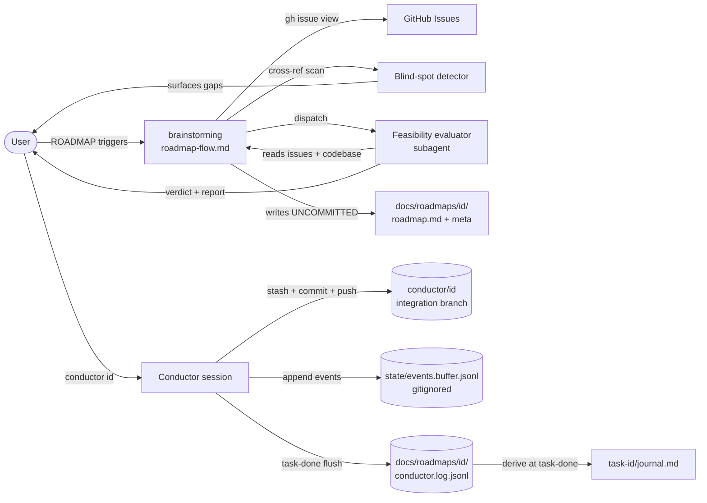

# Conductor v2.5 — Design

**Status:** Design draft
**Date:** 2026-05-01
**Builds on:** [docs/specs/2026-04-30-conductor-design.md](./2026-04-30-conductor-design.md) (v1)

## Purpose

Four cross-cutting improvements to the conductor skill, derived from a real-world v1 run, shipped as one coherent v2.5:

1. **`ROADMAP:` brainstorm mode** — turns a list of existing GitHub issues into a `roadmap.md` (no issue creation, no commit). Includes a feasibility-evaluator subagent that surfaces blind spots, codebase prerequisites, and cross-task conflicts before the roadmap is finalised.
2. **Auto-commit at session start** — conductor commits the user's uncommitted seed files (`roadmap.md`, `roadmap-meta.md`) onto the integration branch itself. The user no longer has to PR-and-merge them manually before invoking conductor.
3. **GitHub issue numbers as task IDs** — branches become `feat/<issue-no>-<keys>` instead of `feat/<index>-<keys>` when the roadmap was produced by the `ROADMAP:` flow. Hand-written roadmaps still work with synthetic 1..N indexes.
4. **Per-roadmap event log** — `conductor.log.jsonl` (durable, committed at task boundaries) plus a derived `task-<id>/journal.md`. Lets the user audit every gate decision, every dispatch, every review verdict, every halt — answering "what happened between conductor and agents?"

## Non-goals

- Cross-repo issue support (`owner/repo#117`). v2.6.
- Issue label queries (`label:roadmap-target`). v2.6.
- Auto-creating GitHub issues during `ROADMAP:` flow. The flow consumes existing issues only; users create issues separately.
- Replacing v1's design — v2.5 is additive. Existing v1 hand-written roadmaps continue to work without changes.

## Architecture



## Touchpoints

| File | Action | Responsibility |
|---|---|---|
| `skills/brainstorming/SKILL.md` | Modify | Add `ROADMAP:` to mode-detection table; update frontmatter description. |
| `skills/brainstorming/roadmap-flow.md` | Create | Authoritative checklist for the new flow. Issue-spec parser, blind-spot detector, feasibility-evaluator dispatch, dependency-proposal, write-without-commit handoff. |
| `skills/conductor/SKILL.md` | Modify | Relax prereq #4: working tree may be dirty *only* for whitelisted seed files. |
| `skills/conductor/conducting-flow.md` | Modify | New Step 0 (detect + stash whitelisted seed files), changes to Step 4-5 (pop into worktree, commit), event-log writes interleaved with phase transitions, journal.md write at Step 12. |
| `skills/conductor/state-schema.md` | Modify | `currentTaskId` semantics now: GitHub issue number when `idsAreIssueNumbers: true`, synthetic index otherwise. New event-log buffer location documented. |
| `skills/conductor/roadmap-format.md` | Modify | `id` semantics doc updated. New `idsAreIssueNumbers` field in `roadmap-meta.md`. New schemas: `conductor.log.jsonl` event taxonomy, `journal.md` shape. |
| `skills/conductor/answer-authority.md` | Minor edit | `gate-decision` event log emission documented (Category, grounding source). |
| `skills/conductor/manual-test.md` | Modify | Adds a `ROADMAP:` invocation path to the smoke test plus journal-output verification step. |

---

## Component 1: `ROADMAP:` brainstorm mode

### Trigger

`ROADMAP: <issue-spec> [optional one-liner about goal]`

Examples:
- `ROADMAP: #117, #120-125 — auth rewrite`
- `ROADMAP: #42`
- `ROADMAP: #100-110, #115`

### Issue-spec syntax

| Form | Expands to |
|---|---|
| `#117` | `[117]` |
| `#120-125` | `[120, 121, 122, 123, 124, 125]` |
| `#117, #120-125` | `[117, 120, 121, 122, 123, 124, 125]` |
| Whitespace tolerant | Same as above with arbitrary spacing |

Parser is implemented inline in `roadmap-flow.md` (no shell out — straightforward regex).

### Checklist (`roadmap-flow.md`)

1. **Parse issue-spec.** Expand ranges, dedupe, sort ascending.
2. **Fetch each issue.** `gh issue view <N> --json number,title,body,state,labels,comments`. Skip with warning if `state == closed` or labels include `wontfix`/`duplicate`. Halt if any issue is unreachable (404, perms).
3. **Blind-spot detection.** For each fetched issue:
   - Extract `#NNN` references from title, body, comments.
   - Filter to references **not** in the user's spec.
   - Extract checkbox sub-items (`- [ ]`) from bodies.
   - Build a "candidate gaps" list with provenance (`#119 referenced by #120 in body as "depends on"`, `subtask "wire telemetry" — checkbox in #122`).
4. **Surface gaps.** Present the candidate gaps and ask: `add <list>` (include in roadmap), `ignore` (proceed without), `redefine` (re-state the issue spec from scratch).
5. **Feasibility evaluator (blocking).** Dispatch a Sonnet subagent with: full issue bodies + comments, the cross-reference output from Step 3, and read access to the codebase. Subagent returns a structured markdown report (rubric below). Surface report to user.
6. **User decision on report:** `accept` (proceed to Step 7), `clarify` (answer the report's open questions inline, re-run evaluator), `rescope` (drop or add tasks, re-run from Step 1), or `cancel`.
7. **Propose dependency order** based on cross-references in issue bodies. Where issue A's body mentions issue B in a "depends on" / "blocked by" position, propose `deps: [B]` for A's task. User confirms or edits.
8. **Roadmap-id derivation.** Lower-case slug from the optional one-liner; if absent, prompt for a short slug. Sanity-check against existing `docs/roadmaps/<id>/` to prevent collisions.
9. **Write roadmap files** to `docs/roadmaps/<roadmap-id>/`:
   - `roadmap.md` — task list with `id` = GitHub issue number, `title` = issue title, `deps` = inferred or user-set, `status: pending`.
   - `roadmap-meta.md` — frontmatter with `roadmapId`, `baseBranch` (defaults to `main`, asked if ambiguous), `integrationBranch`, `idsAreIssueNumbers: true`.
10. **DO NOT commit.** Surface to user: *"Roadmap written to `docs/roadmaps/<id>/` — files are NOT committed. Invoke `conductor <id>` and conductor will commit them onto the integration branch as its first action."*
11. **Exit cleanly.**

### Feasibility evaluator rubric

The evaluator subagent reads everything and returns a markdown report with these sections:

```markdown
## Per-task feasibility

### #<id> — <title>
- Completeness: <clear acceptance criteria? ✓ / ⚠ / ✗>
- Codebase prerequisites: <do named files/symbols exist? findings>
- External deps: <libraries, infra, env vars likely required>
- Risk: <low / medium / high — one-sentence why>

## Roadmap-level
- Coherence: <do these tasks form a deliverable thing?>
- Scope: <appropriate / too small / too large>
- Hidden deps: <issues referenced but not in spec>
- Proposed task order: <topological sort if non-trivial>

## Open questions for the user
- <enumerate questions whose answers materially affect the roadmap>

## Verdict
READY | READY-WITH-CLARIFICATIONS | NEEDS-RESCOPE
```

The evaluator's job is to **synthesize** across many issues + codebase signals and surface what a human reviewer would catch. The verdict is advisory — the user makes the final call at Step 6.

### Output contract

The flow produces TWO uncommitted files in the working tree (`roadmap.md`, `roadmap-meta.md`) and exits. No commits, no pushes, no branches created. Conductor handles everything from there.

---

## Component 2: Auto-commit seed files at session start

### Prereq change in `SKILL.md`

The "working tree is clean" prereq becomes:

> **Working tree is clean OR has only whitelisted dirty files.** Run `git status --porcelain`. The output is acceptable IFF every dirty path matches `docs/roadmaps/<roadmap-id>/*.md`. Any non-whitelisted dirty path → abort (the user has unrelated work in flight; tell them to commit or stash before invoking conductor).

### New Step 0 in `conducting-flow.md`

Inserted before the existing Step 1 of the session-start checklist. State.json doesn't exist yet at this point (it's initialized in Step 7 inside the worktree), so the recovery primitive is a **deterministic stash message** rather than a state-file flag — the stash itself records the pending hand-off.

```
0. **Detect or reuse a stashed seed bundle.**

   Stash message format: "conductor:<roadmap-id>:seed"

   a. Check for an existing stash entry with that message:
      git stash list | grep "conductor:<roadmap-id>:seed"

   b. If an existing stash entry is found (resume after a Step-0..Step-5a crash):
      do nothing here — Step 5a will pop it. Skip to Step 1.

   c. Otherwise, scan the working tree:
      git status --porcelain -- docs/roadmaps/<roadmap-id>/

      - If no whitelisted dirty files → no-op (user pre-committed seed; v1 path).
        Skip to Step 1.
      - If whitelisted dirty files exist (with paths matching docs/roadmaps/<roadmap-id>/*.md):
        git stash push --include-untracked \
          -m "conductor:<roadmap-id>:seed" \
          -- docs/roadmaps/<roadmap-id>/

        The deterministic message is the recovery contract: any future Step 0
        run for the same roadmap-id can locate this stash even after a crash
        (state.json doesn't exist yet at this point — the worktree is built in
        Step 5).
```

### Modified Step 4-5

```
4. Init the integration branch (only on fresh roadmap):
   git fetch origin "$BASE_BRANCH"
   git push origin "origin/$BASE_BRANCH:refs/heads/$INTEGRATION_BRANCH"

5. Init the conductor worktree on $INTEGRATION_BRANCH (existing).

5a. (NEW) Check for the seed stash and pop it into the worktree if present.

    STASH_REF=$(git stash list | grep "conductor:<roadmap-id>:seed" | head -1 | cut -d: -f1)

    - If STASH_REF is empty → no-op (user pre-committed; v1 path).
      Skip to Step 6.
    - If STASH_REF is set:
      git -C "$WORKTREE" stash pop "$STASH_REF"
      git -C "$WORKTREE" add docs/roadmaps/<roadmap-id>/
      git -C "$WORKTREE" commit -m "chore(conductor): seed roadmap <roadmap-id>"
      git -C "$WORKTREE" push

    The main tree is now clean — the seed files are durably committed
    on the integration branch, no longer in the user's working area.
    They will reappear in the main tree's working area when conductor
    checks out the per-task feat branch (Step 3 of per-task loop), since
    that branch is forked from the integration branch.
```

**Why a stash message rather than a state.json field?** State.json lives in the worktree's `state/` directory, which doesn't exist until Step 6. Step 0 happens before that. If conductor crashed between Step 0 and Step 5a, a state.json field couldn't help recover — it would never have been written. The stash itself is the durable record, and `git stash list | grep <message>` is the lookup mechanism.

### Edge cases

| Case | Behavior |
|---|---|
| User already committed seed files (v1 path) | Step 0 no-op. Backward-compatible. |
| `git stash push` fails (e.g., merge conflict against worktree's HEAD) | Halt with clear error. Don't auto-recover. |
| Non-whitelisted dirty file present | Abort at prereq #4 before stashing anything. |
| `git stash pop` in worktree fails (rare) | Halt; user resolves manually. The stash entry remains intact. |
| Conductor crashes between Step 0 and Step 5a | On resume: Step 0 finds the existing `conductor:<roadmap-id>:seed` stash via `git stash list`, leaves it in place; Step 5a pops it into the worktree and finishes idempotently. State.json is irrelevant here (doesn't exist yet at Step 0). |

---

## Component 3: GitHub issue numbers as task IDs

### Schema change in `roadmap-format.md`

The `id` field's documentation updates to:

> `id` (number, required) — When the roadmap was produced by the `ROADMAP:` flow, this is the GitHub issue number (e.g., `117`). When the roadmap is hand-written, this is a synthetic 1..N index. Conductor doesn't differentiate — it uses `id` literally for branch naming, summary directory naming, and event-log keys.

### New optional field in `roadmap-meta.md`

`idsAreIssueNumbers: true | false` (default: `false`)

When `true`:
- Conductor opens per-task PRs with bodies like "Closes #<id>" so merging the per-task PR auto-closes the GitHub issue.
- Final roadmap PR title reads "Tasks #117, #120-#125" (each is a clickable GitHub link).
- The `ROADMAP:` flow always sets this to `true` when it writes the meta file.

When `false` (or absent):
- Per-task PR body has no auto-close phrase.
- Final PR title uses synthetic ranges like "Tasks 1-7."
- Hand-written roadmaps default here.

### Branch-key derivation in `conducting-flow.md` Step 1

No logic change. The existing rule "feat/<id>-<keys> with kebab-cased title" works for both worlds — `id` is just a number string interpolation.

### Per-task summary directory

`docs/roadmaps/<roadmap-id>/task-<id>/summary.md` — `<id>` is whatever the YAML says. So the directory is `task-117/` for issue-numbered roadmaps. Tasks aren't sorted lexically by directory name when ids are issue numbers; that's fine because `roadmap.md` is the index.

---

## Component 4: Event log + journal

### Files

| Path | Durability | Purpose |
|---|---|---|
| `docs/roadmaps/<id>/state/events.buffer.jsonl` | Gitignored, in conductor worktree | Append-only buffer during a task. Atomic appends via shell `>>`. |
| `docs/roadmaps/<id>/conductor.log.jsonl` | Committed | Durable event log. Flushed-from-buffer at task-done. |
| `docs/roadmaps/<id>/task-<id>/journal.md` | Committed | Human-readable narrative derived from log.jsonl at task-done. Co-located with `summary.md`. |

### Event taxonomy

Every event shares: `{ts: ISO-8601, phase: <state-schema phase>, taskId: <id>, eventType: <see below>}`. Additional fields per type:

| eventType | Additional fields |
|---|---|
| `session-start` | `roadmapId`, `baseBranch`, `integrationBranch` |
| `task-start` | `taskId`, `branchKey`, `dependencies: [<ids>]` |
| `auto-dispatched` | `subAgentId`, `dispatchPromptHash` (sha256 of prompt; full prompt is too long for the log), `branchContract` (verbatim) |
| `auto-returned` | `subAgentId`, `returnType` (`success` / `gate` / `failure`), `returnMessageExcerpt` (first 500 chars) |
| `gate-decision` | `subAgentId`, `gateQuestion` (verbatim), `decision` (`answer` / `halt`), `groundingSource` (when `answer`), `category` (`A` / `B` / `C` per `answer-authority.md`) |
| `review-dispatched` | `currentReviewId`, `prNumber` |
| `review-verdict` | `currentReviewId`, `mustFixesCount`, `nitsCount`, `ciStatus` (`green` / `red`), `verbatimMustFixes` |
| `feedback-sent` | `subAgentId`, `feedbackBody`, `fixLoopRound` |
| `merge-decision` | `prNumber`, `result` (`merged` / `failed`), `mergeSha` |
| `task-halted` | `lastHaltQuestion`, `phase` (`auto-blocked-on-gate` / `task-halted`), `cause` (`gate` / `failure` / `fix-loop-exhausted` / `merge-failed` / `contract-violation`) |
| `task-resumed` | `resumeAction` (`resume` / `restart` / `abort`), `userMessage` (verbatim if `resume`) |
| `task-done` | `prNumber`, `summaryPath`, `journalPath`, `mergeSha` |
| `roadmap-end` | `finalPrUrl`, `tasksCompleted`, `tasksHalted`, `totalDuration` |

### Write mechanics

**During a task:**
- Conductor appends one line per event to the buffer (gitignored, in worktree):
  ```bash
  echo "$EVENT_JSON" >> "$WORKTREE/docs/roadmaps/$ID/state/events.buffer.jsonl"
  ```
- Atomic `>>` redirect — no temp-file dance needed for single-line appends; POSIX guarantees the line lands intact.
- Buffer accumulates across the task's full lifecycle (all phases until `task-done`).

**At task-done (existing Step 12 of `conducting-flow.md`):**
1. Concat the buffer onto the durable log:
   ```bash
   cat "$WORKTREE/docs/roadmaps/$ID/state/events.buffer.jsonl" >> "$WORKTREE/docs/roadmaps/$ID/conductor.log.jsonl"
   ```
2. Truncate the buffer:
   ```bash
   : > "$WORKTREE/docs/roadmaps/$ID/state/events.buffer.jsonl"
   ```
3. Generate `task-<id>/journal.md` from the lines just appended (see template below).
4. Stage and commit `task-<id>/`, `roadmap.md`, and `conductor.log.jsonl` in the existing task-done commit. No new commit type introduced.

**On crash mid-task:**
- Buffer survives (it's a real file, just not committed yet).
- On resume, conductor inspects the buffer's contents. If the last event was `task-done`, the flush was interrupted before truncation — finish the flush idempotently. Otherwise the buffer represents un-flushed work; preserve it for the still-in-progress task.

### `journal.md` template

```markdown
# Task <id> — <title>

**Branch:** `feat/<id>-<keys>`   |   **PR:** [#<prNumber>](<prUrl>) (merged at <mergeSha>)
**Started:** <session-start ts>   |   **Done:** <task-done ts>   |   **Duration:** <elapsed>

## Timeline

<for each event in this task's log slice, emit one line:>
<HH:MM:SS>  <event description in past tense; gate Q&A on its own indented line>

## Gate decisions

<for each gate-decision event, summarize:>
- **Q:** <gateQuestion>
- **A:** <decision == "answer" ? answer text : "[halted to human]">
- **Source:** <groundingSource> (Category <A|B|C>)

## Review rounds

<for each review-verdict in this task:>
- Round <fixLoopRound>: <mustFixesCount> must-fixes, <nitsCount> nits, CI <green|red>
  <if must-fixes:>  Sent feedback; AUTO pushed fixes
```

### Why this works

- **Audit trail.** Every conductor decision is recorded with the artifacts it grounded itself in. A user can read `journal.md` and see exactly what conductor told AUTO and why.
- **Cheap.** Few KB per task; one append per event; no new commits.
- **Recoverable.** Buffer flushing is idempotent; crash mid-task loses only un-flushed events from the in-progress task (which the user re-derives on resume anyway).
- **Composable.** The JSONL is machine-parseable for future tooling (e.g., a `conductor stats <roadmap-id>` command that aggregates fix-loop rounds, halt rates, etc.). v2.5 doesn't build that — the data is just there for v2.6+.

---

## Error handling (cross-component)

| Failure | Behavior |
|---|---|
| `ROADMAP:` flow can't fetch issue (404, perms) | Halt with the issue number. User fixes auth/access and retries. |
| Feasibility evaluator returns `NEEDS-RESCOPE` | Surface verbatim. User redefines the issue spec or accepts the recommendation to drop tasks. |
| Auto-commit detects non-whitelisted dirty files | Abort at prereq #4. Tell user to commit or stash unrelated work. |
| `git stash push` fails | Halt with the verbatim git error. User resolves manually. |
| Event log buffer is unparseable JSONL on resume | Halt. Treat as corrupted-state per `resume-procedure.md`. |
| `idsAreIssueNumbers: true` but a task's `id` doesn't match a known GitHub issue | Soft warning at session-start (the issue may have been deleted). Not abort. |
| Journal generation fails | Halt at task-done. User inspects the buffer + log manually. Don't ship a half-written journal. |

## Testing

- **Unit-shaped:**
  - Issue-spec parser: `#117, #120-125, #133` → `[117, 120-125, 133]`. Edge cases: trailing comma, negative numbers (reject), overlapping ranges (dedupe).
  - Event-log JSONL line shape validators per eventType.
  - `journal.md` derivation: input log slice, output markdown.

- **Integration:**
  - Mock `gh issue view`, run `roadmap-flow.md` against a fixture set of 5 issues with cross-references. Verify blind-spot detector surfaces the right gaps.
  - Mock conductor's seed-commit pipeline (Step 0 → 5a). Verify stash → pop → commit → push and that the main tree is clean afterward.

- **Manual e2e (extends `manual-test.md`):**
  - Create 3 throwaway GitHub issues with cross-references (#1, #2 deps on #1, #3 references something not in spec).
  - Invoke `ROADMAP: #1, #2, #3 — smoke test`.
  - Verify: feasibility report references `#3`'s missing reference; user accepts; roadmap files written uncommitted.
  - Invoke `conductor smoke-test` (the slug from the one-liner).
  - Verify: seed files committed onto integration branch; per-task branches use issue numbers (`feat/1-...`, `feat/2-...`); each task produces a `task-<n>/journal.md` with at least one gate decision logged; final PR title includes `#1, #2, #3`.

## Risks and open questions

### 1. Issue-spec parser edge cases

The parser must handle whitespace, trailing commas, and overlapping ranges sanely. Plan-time decision: be strict (reject ambiguous input with a clear error) rather than guess. Mitigation: comprehensive parser unit tests.

### 2. Feasibility evaluator's codebase scan cost

The evaluator may grep the codebase for files/symbols named in many issues. For a 7-task roadmap that's potentially many `Grep` calls. v2.5 mitigation: budget the evaluator to ~50 grep ops per dispatch; if a task's body names too many symbols, surface the limit hit as a flag rather than blocking. Future v2.6: precompute a codebase symbol index.

### 3. Event log size growth

10-task roadmaps with multiple fix-loop rounds could produce hundreds of events per roadmap. Per-task `journal.md` files stay small (one task slice each), but the cumulative `conductor.log.jsonl` grows. Mitigation: expected size for a 10-task roadmap is ~50 KB — acceptable. If users run conductor against 50+ task roadmaps regularly, we add a log-rotation primitive in v2.6.

### 4. Backward compatibility with v1 roadmaps

A v1 roadmap with synthetic ids (1, 2, 3) and no `idsAreIssueNumbers` field must continue to work after upgrading to v2.5. Mitigation: `idsAreIssueNumbers` defaults to `false` when absent. All v2.5 logic that branches on this field reads the default safely.

### 5. Concurrent `ROADMAP:` invocations

Two simultaneous brainstorming sessions writing to the same roadmap-id could race. v2.5 trusts the user not to do this (matches v1's single-conductor-session assumption). Lock file primitive deferred to v2.6.

## Alternatives considered and rejected

- **Ship as four independent commits.** Rejected — items 1+3 are coupled (the brainstorm flow is the natural producer of issue-numbered tasks); shipping them separately leaves an awkward intermediate state.
- **Auto-create GitHub issues during `ROADMAP:` flow.** Rejected — conflicts with the user's explicit intent ("just write down roadmap.md, no need new github issue"). Users create issues separately, the flow consumes them.
- **Store events in `state.json` instead of a separate log.** Rejected — `state.json` is overwritten on every transition; events need append-only. Different durability requirements.
- **Make the feasibility evaluator optional.** Rejected — without it, the brainstorm flow is just a YAML formatter; the user's "black point" concern is unaddressed. The evaluator IS the value-add.
- **Commit events on every transition instead of batching.** Rejected — would add 10-50 commits per task to the integration branch, making the git log unreadable. Task-boundary batching keeps commit graph clean.
- **Use `state.json`'s `lastHaltQuestion` field as the audit trail.** Rejected — only captures the most recent halt; loses every prior gate decision. Needs append-only.

## Migration

- **No migration script needed.** Existing v1 roadmaps continue working unchanged. New roadmaps benefit from v2.5 features automatically (when produced by `ROADMAP:` flow) or opt-in (when hand-written and the user adds `idsAreIssueNumbers: true`).
- **Existing `state.json` files** are unchanged by v2.5 — no new fields. The seed-stash recovery uses a stash message, not a state-file flag (see § Component 2 § "Why a stash message"). `currentSpecPath` from v1's c417790 remains.
- **Existing `roadmap-meta.md` files** without `idsAreIssueNumbers` field continue working — defaults to `false`.
