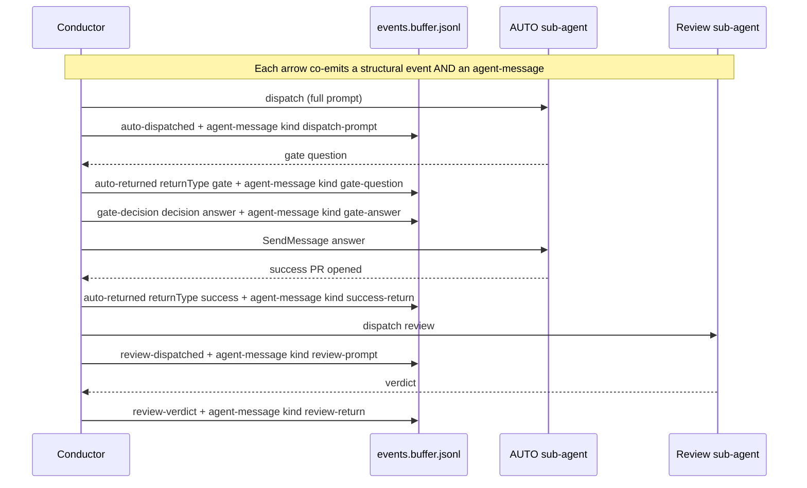

# Conductor v2.6 — Conversation Transcript Layer

**Status:** approved 2026-05-03
**Builds on:** [v2.5 design](2026-05-01-conductor-v25-design.md) (released as 5.0.7-d.10)
**Goal:** make `task-<N>/journal.md` a replayable conversation transcript so users can audit "what was said when" between conductor and the dispatched agents.

## Problem

v2.5 captures structural metadata about every conductor↔agent exchange (who, when, decision, counts) but the *bodies* of messages are partial:

- `auto-dispatched` hashes the dispatch prompt; only `branchContract` survives verbatim.
- `auto-returned` truncates the return message to `returnMessageExcerpt` (first 500 chars).
- `gate-decision` records `groundingSource` (the citation) but not the conductor's actual answer text sent via SendMessage.
- `review-dispatched` has no body at all.
- `review-verdict` keeps `verbatimMustFixes` but discards the rest of the review's verdict body.

Result: the journal can answer "did this task halt?" but not "what did AUTO actually ask, and what did conductor say back?" — the latter being where almost all interesting debugging happens.

## Approach

Add a single new event type, `agent-message`, that records every message body in either direction (conductor↔auto, conductor↔review). It is **co-emitted alongside** the existing v2.5 structural events — no v2.5 schema changes. The journal gains a new `## Conversation transcript` section appended after `## Review rounds`, rendered from the agent-message stream.

The structural events keep their typed metadata (counts, IDs, decisions) for at-a-glance summaries and direct query. Agent-messages are the canonical location for verbatim message bodies. Same timestamp pair on both events so a journal generator can correlate them losslessly.

## Architecture



## `agent-message` event schema

```jsonc
{
  "ts": "ISO-8601",
  "phase": "<phase>",
  "taskId": <id>,
  "eventType": "agent-message",
  "sender": "conductor" | "auto" | "review",
  "recipient": "conductor" | "auto" | "review",
  "subAgentId": "<id>" | null,
  "messageKind": "dispatch-prompt" | "gate-question" | "gate-answer" |
                 "success-return" | "failure-return" | "review-prompt" |
                 "review-return" | "feedback" | "fixes-pushed-return",
  "body": "<verbatim message text>"
}
```

**Field rules:**

| Field | Type | Notes |
|---|---|---|
| `sender` / `recipient` | enum | `conductor`, `auto`, `review`. Both fields always present; conductor is exactly one side. |
| `subAgentId` | string \| null | Identifies which AUTO or Review sub-agent is on the non-conductor side. Null is only theoretical — every emission point already knows the id. |
| `messageKind` | enum | Mirrors AUTO's gate vocabulary plus dispatch/return/feedback variants. Self-describing — journal generator does not need to correlate with structural events. |
| `body` | string | Verbatim. Newlines escaped per JSONL. No truncation. Dispatch prompts (largest) are 1–5 KB. |

### `messageKind` enum

| Kind | Sender → Recipient | Co-emitted with |
|---|---|---|
| `dispatch-prompt` | conductor → auto | `auto-dispatched` |
| `gate-question` | auto → conductor | `auto-returned` (returnType=gate) |
| `gate-answer` | conductor → auto | `gate-decision` (decision=answer) |
| `success-return` | auto → conductor | `auto-returned` (returnType=success) |
| `failure-return` | auto → conductor | `auto-returned` (returnType=failure) |
| `review-prompt` | conductor → review | `review-dispatched` |
| `review-return` | review → conductor | `review-verdict` |
| `feedback` | conductor → auto | `feedback-sent` |
| `fixes-pushed-return` | auto → conductor | `auto-returned` (after feedback push, returnType=success) |

A `gate-decision` with `decision: "halt"` does NOT co-emit a `gate-answer` agent-message — there is no answer when conductor halts to human. The structural `gate-decision` event records the halt decision; the message stream stays consistent (no orphaned reply).

## Co-emission discipline

Every emission point that currently writes a structural event ALSO writes its sibling agent-message. The two events share the same `ts` (or `ts` + 1 second when ordering matters). The append idiom is two adjacent atomic writes:

```bash
# Structural event (existing v2.5)
EVENT_JSON=$(jq -nc ... '{eventType:"auto-dispatched", ...}')
echo "$EVENT_JSON" >> "$WORKTREE/docs/roadmaps/$ROADMAP_ID/state/events.buffer.jsonl"

# Agent-message sibling (new in v2.6)
MSG_JSON=$(jq -nc \
  --arg ts "$TS" \
  --arg phase "auto-running" \
  --argjson taskId "$TASK_ID" \
  --arg subAgentId "$SUB_AGENT_ID" \
  --arg body "$DISPATCH_PROMPT" \
  '{ts:$ts, phase:$phase, taskId:$taskId, eventType:"agent-message",
    sender:"conductor", recipient:"auto",
    subAgentId:$subAgentId, messageKind:"dispatch-prompt", body:$body}')
echo "$MSG_JSON" >> "$WORKTREE/docs/roadmaps/$ROADMAP_ID/state/events.buffer.jsonl"
```

POSIX guarantees each single-line append is atomic; the two events are not transactionally bound (a crash between them leaves the structural event without its message body), but this matches the existing v2.5 reliability model — the journal generator handles a missing agent-message by labeling the corresponding section "[message body unavailable]" and proceeding.

## Journal rendering — `## Conversation transcript` section

Appended after `## Review rounds`. Renders all events with `eventType == "agent-message"` and matching `taskId`, in chronological order. Block format:

```markdown
### [HH:MM:SS] <sender> → <recipient> (<subAgentId>) — <messageKind>
> <body, blockquoted line by line>
```

Worked example (extending the v2.5 example):

```markdown
## Conversation transcript

### [07:00:02] conductor → auto (a8f4c0ee04af6b333) — dispatch-prompt
> AUTO: Add JWT verification middleware and types
>
> ## Branch contract
> You are on `feat/117-add-jwt-verification`, checked out off conductor/auth-rewrite-smoke...

### [07:08:42] auto (a8f4c0ee04af6b333) → conductor — gate-question
> Gate A spec preview: should this use HS256 or RS256? RS256 implies a key-rotation pipeline I do not see in the repo.

### [07:08:43] conductor → auto (a8f4c0ee04af6b333) — gate-answer
> Use HS256. Grounded in: alice's #117 comment confirms missing key-rotation infra; src/auth/* grep shows no key-management code.

### [07:14:11] auto (a8f4c0ee04af6b333) → conductor — success-return
> Implementation complete. PR #142 opened against conductor/auth-rewrite-smoke. Checkpoints 3 and 3.5 passed. Spec: docs/specs/2026-05-03-jwt-middleware-design.md
```

When the conductor side is the sender, the `→ auto (id)` and `→ review (id)` block headers identify which agent. When the agent side is the sender, the agent's id is shown next to its role (`auto (id) → conductor`).

### Generation rules

- Filter `conductor.log.jsonl` to events with `taskId == $TASK_ID && eventType == "agent-message"`, ordered by `ts`.
- Emit one block per event. Block header per the format above.
- Body is blockquoted by prepending `> ` to each line; empty lines become `>`.
- If a structural event has no sibling agent-message (crash between writes, or v2.5 log being read by v2.6 generator), insert a placeholder block: `### [HH:MM:SS] <sender> → <recipient> — <inferred kind from structural event> [message body unavailable]`.
- Section heading `## Conversation transcript` is emitted only if at least one agent-message exists. Empty transcript → omit heading (consistent with v2.5's empty-section rule for Gate decisions / Review rounds).

## Files touched

| File | Change | Approx. lines |
|---|---|---|
| `skills/conductor/roadmap-format.md` | Add `agent-message` row to event taxonomy table; new subsection documenting `messageKind` enum + co-emission discipline; extend `task-<N>/journal.md` template with the Conversation transcript section | ~80 |
| `skills/conductor/conducting-flow.md` | Extend `### Event log emissions` table with co-emission rows; add agent-message jq blocks at Steps 5, 6, 8, 9; extend Step 12 journal-generation block to render the transcript section | ~150 |
| `skills/conductor/answer-authority.md` | Add `gate-answer` agent-message emission to the answer protocol (alongside the existing `gate-decision` at step 1.5) | ~20 |
| `skills/conductor/examples/log.jsonl` | Extend from 10 → 16 events (10 structural + 6 new agent-message siblings: dispatch-prompt, gate-question, gate-answer, success-return, review-prompt, review-return; the worked example has 0 must-fixes so no `feedback` / `fixes-pushed-return` siblings) | +6 lines |
| `skills/conductor/examples/journal.md` | Append the new Conversation transcript section to the worked example | ~30 |
| `skills/conductor/manual-test.md` | Add verification step: "the journal contains a `## Conversation transcript` section with at least one block per agent-message in the log" | ~5 |

Total: 6 files, ~290 lines of changes. No new files. No existing v2.5 events touched.

## Tradeoffs and risks

- **Log size grows ~10× per task** (5–20 KB vs. v2.5's 1–2 KB). Per-roadmap not project-wide; user accepted in earlier conversation.
- **Duplication of body data.** `branchContract` (in `auto-dispatched`) is a subset of the dispatch-prompt agent-message body. `feedbackBody` (in `feedback-sent`) duplicates the feedback agent-message body. `verbatimMustFixes` (in `review-verdict`) is a subset of the review-return body. Documented explicitly in roadmap-format.md: **agent-message is the canonical body location for the journal**; structural-event verbatim fields stay for backward compat and direct-query convenience.
- **Sensitive content in durable commits.** Full feedback bodies may carry CI logs or env values. The log is committed to the integration branch on the user's GitHub remote, so the user's existing repo-content policy applies. Spec calls this out; redaction is deferred to v2.7.
- **Two-write atomicity.** Structural event and its agent-message are two separate `echo` appends. A crash between them leaves an orphaned structural event. Journal generator handles this with the `[message body unavailable]` placeholder. The cost of changing this (e.g., wrapping in a fsync barrier or using a transactional log) outweighs the benefit at this reliability level.

## Out of scope for v2.6

- Redaction / PII filtering before durable commit (deferred to v2.7).
- A `conductor replay <task-id>` command. The journal IS the replay.
- Cross-task transcript views (the journal is per-task by design).
- Compressing or chunking large dispatch prompts (size is acceptable per earlier calibration).

## Backward compatibility

- v2.5 logs (no agent-message events) render in v2.6 with the Conversation transcript section omitted. No breakage.
- v2.6 logs render in v2.5 generators only as far as the structural events are concerned (any v2.5 generator that reads the log will see unfamiliar `eventType: "agent-message"` lines and should skip them, which the existing JSON-parsing approach naturally does).
- No version bump needed in `roadmap-meta.md` — schema additions are backward-compatible.

## Migration

None required. v2.6 begins emitting agent-message events at next conductor session start; existing roadmap directories continue to function. Tasks that started under v2.5 and resume under v2.6 will have agent-messages from the resume point onward (and a placeholder for any earlier orphaned structural events when the journal is regenerated).

## Acceptance criteria

1. `roadmap-format.md` documents the `agent-message` event with all 9 messageKind values.
2. `conducting-flow.md` co-emits agent-message at every relevant point per the table above.
3. `answer-authority.md` co-emits `gate-answer` alongside the existing `gate-decision` answer-protocol emission.
4. The journal generator in conducting-flow.md Step 12 renders a `## Conversation transcript` section when at least one agent-message exists for the task, omits the heading otherwise.
5. `examples/log.jsonl` and `examples/journal.md` are extended consistently and parse as valid JSONL / Markdown.
6. `manual-test.md` includes a verification step for the new section.
7. v2.5 logs render correctly under v2.6 (transcript section omitted, no errors).
