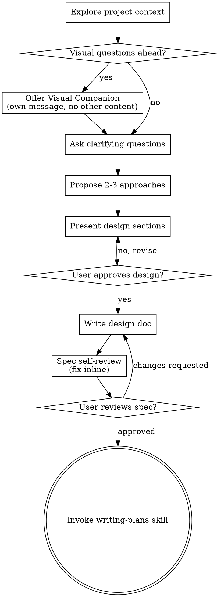

# Brainstorming Ideas Into Designs

Help turn ideas into fully formed designs and specs through natural collaborative dialogue.

Start by understanding the current project context, then ask questions one at a time to refine the idea. Once you understand what you're building, present the design and get user approval.

<HARD-GATE>
Do NOT invoke any implementation skill, write any code, scaffold any project, or take any implementation action until you have presented a design and the user has approved it. This applies to EVERY project regardless of perceived simplicity.
</HARD-GATE>

## Anti-Pattern: "This Is Too Simple To Need A Design"

Every project goes through this process. A todo list, a single-function utility, a config change — all of them. "Simple" projects are where unexamined assumptions cause the most wasted work. The design can be short (a few sentences for truly simple projects), but you MUST present it and get approval.

## Prerequisite
### Code Style Config

At the start of this skill, check if `.agents/config/code-style.md` exists at the
repository root (the directory `git rev-parse --show-toplevel` returns; fall back to
the current workspace if not in a git repo). If it does, read it and apply its
conventions throughout this skill's execution — file naming, directory structure,
component patterns, etc.

If the file doesn't exist, proceed with no assumptions about code style.

## Mode Detection

This skill has four modes. The mode is chosen by the user's opening message; no confirmation is asked.

| Mode | Trigger phrasing (examples, case-insensitive) | Flow file |
|---|---|---|
| **Epic** | `brainstorm an epic`, `this is an epic`, `EPIC:`, `epic brainstorm` | `skills/brainstorming/epic-flow.md` |
| **User Story** | `brainstorm a user story`, `this is a us`, `US:`, `user story brainstorm` | `skills/brainstorming/user-story-flow.md` |
| **Scope** | `SCOPE:`, `scope brainstorm`, `brainstorm scope`, `quick brainstorm` | `skills/brainstorming/scope-flow.md` |
| **Task** | *(default — anything else)* | continues in this SKILL.md |

### Detection rule

Scan the user's first message in the session for one of the Epic, User Story, or Scope trigger phrasings above. Match case-insensitively against an explicit declaration — not a casual mention. If multiple trigger phrasings would match, use priority: **Epic > User Story > Scope > Task** — planning-grade brainstorms must never be downgraded. If matched:

1. Announce the chosen mode to the user in one sentence: e.g., *"Running brainstorming in Epic mode."*
2. Load the corresponding flow file with the Read tool.
3. Follow that flow file as the authoritative checklist for the rest of the session. The `## Checklist` and `## Process Flow` sections below do NOT apply to Epic, User Story, or Scope mode.

If none of the Epic, User Story, or Scope triggers match, continue with the Task flow (the rest of this file). The user does not need to say "Task" explicitly — it is the default.

### Shared sections that still apply in all modes

- The `<HARD-GATE>` block and the `## Anti-Pattern: "This Is Too Simple To Need A Design"` section (both above) — apply to all modes. No mode is allowed to skip design approval.
- `## Prerequisite` / `### Code Style Config` (above) — applies to all modes.
- `## Visual Companion` (below) — applies to all modes.
- `## When to Dispatch external-researcher` (below) — applies to all modes.

Everything else in this file below describes the Task flow only.

---

## Checklist

You MUST create a task for each of these items and complete them in order:

1. **Explore project context** — check files, docs, recent commits
2. **Offer visual companion** (if topic will involve visual questions) — this is its own message, not combined with a clarifying question. See the Visual Companion section below.
3. **Ask clarifying questions** — one at a time, understand purpose/constraints/success criteria
4. **Propose 2-3 approaches** — with trade-offs and your recommendation
5. **Present design** — in sections scaled to their complexity, get user approval after each section
6. **Write design doc** — save to `docs/specs/YYYY-MM-DD-<topic>-design.md` and commit
7. **Spec self-review** — quick inline check for placeholders, contradictions, ambiguity, scope (see below)
8. **User reviews written spec** — ask user to review the spec file before proceeding
9. **Transition to implementation** — invoke writing-plans skill to create implementation plan

## Process Flow

**For Task mode, the terminal state is invoking writing-plans.** Do NOT invoke frontend-design, mcp-builder, or any other implementation skill. The ONLY skill you invoke after a Task brainstorm is writing-plans. (Epic and User Story modes terminate in their own flow files and do NOT invoke writing-plans.)

## The Process

**Understanding the idea:**

- Check out the current project state first (files, docs, recent commits)
- Before asking detailed questions, assess scope: if the request describes multiple independent subsystems (e.g., "build a platform with chat, file storage, billing, and analytics"), flag this immediately. Don't spend questions refining details of a project that needs to be decomposed first.
- If the project is too large for a single spec, help the user decompose into sub-projects: what are the independent pieces, how do they relate, what order should they be built? Then brainstorm the first sub-project through the normal design flow. Each sub-project gets its own spec → plan → implementation cycle.
- For appropriately-scoped projects, ask questions one at a time to refine the idea
- Prefer multiple choice questions when possible, but open-ended is fine too
- Only one question per message - if a topic needs more exploration, break it into multiple questions
- Focus on understanding: purpose, constraints, success criteria

**Exploring approaches:**

- Propose 2-3 different approaches with trade-offs
- Present options conversationally with your recommendation and reasoning
- Lead with your recommended option and explain why

**Presenting the design:**

- Once you believe you understand what you're building, present the design
- Scale each section to its complexity: a few sentences if straightforward, up to 200-300 words if nuanced
- Ask after each section whether it looks right so far
- Cover: architecture, components, data flow, error handling, testing
- For architecture overviews, component relationships, and data/control flow, prefer mermaid diagrams over prose — they communicate structure faster and more precisely. Use prose when the system is too simple to warrant a diagram.
- Be ready to go back and clarify if something doesn't make sense

**Design for isolation and clarity:**

- Break the system into smaller units that each have one clear purpose, communicate through well-defined interfaces, and can be understood and tested independently
- For each unit, you should be able to answer: what does it do, how do you use it, and what does it depend on?
- Can someone understand what a unit does without reading its internals? Can you change the internals without breaking consumers? If not, the boundaries need work.
- Smaller, well-bounded units are also easier for you to work with - you reason better about code you can hold in context at once, and your edits are more reliable when files are focused. When a file grows large, that's often a signal that it's doing too much.

**Working in existing codebases:**

- Explore the current structure before proposing changes. Follow existing patterns.
- Where existing code has problems that affect the work (e.g., a file that's grown too large, unclear boundaries, tangled responsibilities), include targeted improvements as part of the design - the way a good developer improves code they're working in.
- Don't propose unrelated refactoring. Stay focused on what serves the current goal.

## After the Design

**Documentation:**

- Write the validated design (spec) to `docs/specs/YYYY-MM-DD-<topic>-design.md`
  - (User preferences for spec location override this default)
- Use mermaid diagrams in the spec for architecture, data flow, and sequences where they appeared during the design conversation. Prefer diagrams over prose for anything structural; use prose for everything else.
- Use elements-of-style:writing-clearly-and-concisely skill if available
- Commit the design document to git

**Spec Self-Review:**
After writing the spec document, look at it with fresh eyes:

1. **Placeholder scan:** Any "TBD", "TODO", incomplete sections, or vague requirements? Fix them.
2. **Internal consistency:** Do any sections contradict each other? Does the architecture match the feature descriptions?
3. **Scope check:** Is this focused enough for a single implementation plan, or does it need decomposition?
4. **Ambiguity check:** Could any requirement be interpreted two different ways? If so, pick one and make it explicit.

Fix any issues inline. No need to re-review — just fix and move on.

**User Review Gate:**
After the spec review loop passes, ask the user to review the written spec before proceeding:

> "Spec written and committed to `<path>`. Please review it and let me know if you want to make any changes before we start writing out the implementation plan."

Wait for the user's response. If they request changes, make them and re-run the spec review loop. Only proceed once the user approves.

**Implementation:**

- Invoke the writing-plans skill to create a detailed implementation plan
- Do NOT invoke any other skill. writing-plans is the next step.

## When to Dispatch external-researcher

During the exploration phase, if the user's idea depends on a specific library, framework, API, or standard you need to verify, dispatch the `external-researcher` subagent (`agents/external-researcher.md`) rather than doing web lookups inline. The agent can read both docs AND library source (node_modules, vendored deps), and returns a short synthesis with sources and a confidence signal.

**When to use it:**
- "How does library X handle Y?" — verify assumptions before designing around them
- "Is there a standard for Z?" — check before proposing an ad-hoc design
- "What's the current best practice for N?" — external context the user may not have

**When NOT to use it:**
- Questions about the user's own code → use Explore instead
- Opinion/judgment calls ("should we use library X or Y?") — the agent cites, it does not decide
- Long-form reports or multi-topic surveys — the agent answers one narrow question per dispatch

Keeps the design conversation clean of raw docs and search noise.

## Key Principles

- **One question at a time** - Don't overwhelm with multiple questions
- **Multiple choice preferred** - Easier to answer than open-ended when possible
- **YAGNI ruthlessly** - Remove unnecessary features from all designs
- **Explore alternatives** - Always propose 2-3 approaches before settling
- **Incremental validation** - Present design, get approval before moving on
- **Be flexible** - Go back and clarify when something doesn't make sense

## Visual Companion

A browser-based companion for showing mockups, diagrams, and visual options during brainstorming. Available as a tool — not a mode. Accepting the companion means it's available for questions that benefit from visual treatment; it does NOT mean every question goes through the browser.

**Offering the companion:** When you anticipate that upcoming questions will involve visual content (mockups, layouts, diagrams), offer it once for consent:
> "Some of what we're working on might be easier to explain if I can show it to you in a web browser. I can put together mockups, diagrams, comparisons, and other visuals as we go. This feature is still new and can be token-intensive. Want to try it? (Requires opening a local URL)"

**This offer MUST be its own message.** Do not combine it with clarifying questions, context summaries, or any other content. The message should contain ONLY the offer above and nothing else. Wait for the user's response before continuing. If they decline, proceed with text-only brainstorming.

**Per-question decision:** Even after the user accepts, decide FOR EACH QUESTION whether to use the browser or the terminal. The test: **would the user understand this better by seeing it than reading it?**

- **Use the browser** for content that IS visual — mockups, wireframes, layout comparisons, architecture diagrams, side-by-side visual designs
- **Use the terminal** for content that is text — requirements questions, conceptual choices, tradeoff lists, A/B/C/D text options, scope decisions

A question about a UI topic is not automatically a visual question. "What does personality mean in this context?" is a conceptual question — use the terminal. "Which wizard layout works better?" is a visual question — use the browser.

If they agree to the companion, read the detailed guide before proceeding:
`skills/brainstorming/visual-companion.md`
